

# Nasscom & VSD SOC Design and Planning

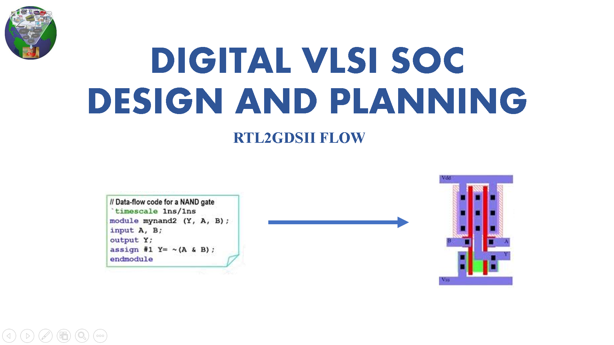
> 2 Week digital VLSI SoC design and planning workshop with complete RTL2GDSII flow organised by VSD in collaboration with NASSCOM

 

# Chip Design and Validation Workflow

An overview of the **chip design and validation workflow** from initial specifications to final applications. The workflow ensures validation consistency across all stages: **O1 = O2 = O3 = O4**.

 
  
 Click to learn about the workflow stages 

## **Workflow Stages**

### **O1: Specifications (C Model)**
- The design begins with defining specifications in a high-level **C model**.
- A **testbench** (in C language) is used to validate functionality early on.

---

### **O2: RTL Design (Verilog)**
- The hardware is implemented as a **soft copy** using **RTL (Verilog)**.
- Major components:
  - **Processor**
  - **Peripherals/IPs**
  - **Analog IPs**
- The design is synthesized, producing a **Gate-Level Netlist** for further validation.

---

### **O3: SoC Integration**
- Modules (processor, peripherals, macros, and analog IPs) are integrated into a **System-on-Chip (SoC)**.
- Physical design steps include:
  - **Floorplanning**
  - **Placement**
  - **Routing**
- The design undergoes:
  - **Design Rule Checks (DRC)**
  - **Layout vs. Schematic (LVS)**  
- Output: **GDSII file** for fabrication.
  
---

### **O4: Final Chip Design**
- The final chip design includes **peripherals** operating in the target frequency range.
- The **testbench** continues validating the design to ensure:
  - **O1 = O2 = O3 = O4**

---

Below are the diagrams that visually represent the chip design workflow:

### Workflow Stages (O1 to O3)

  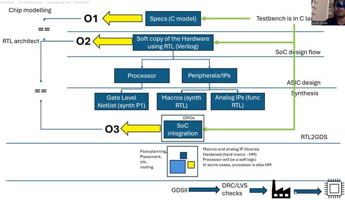

### Final Validation and Applications (O4)

  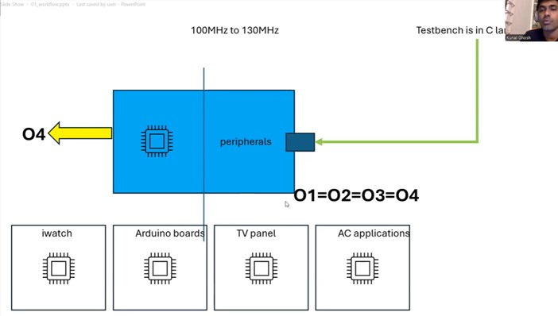

# Section 1 - Inception of open-source EDA, OpenLANE and Sky130 PDK (28/03/2024 - 29/03/2024)

 

## Introduction to QFN-48 Package, chip, pads, core, die and Ips 

### Overview of an Embedded Board Design

  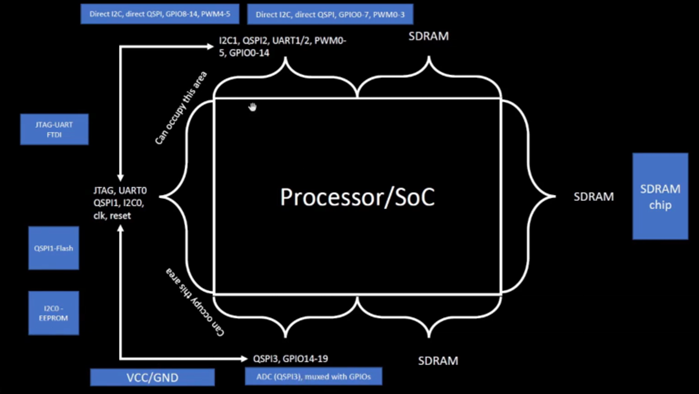

### Inside a Package

  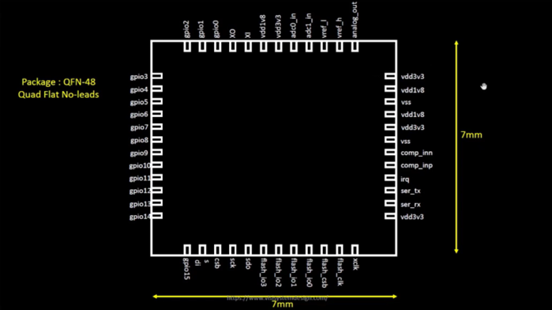

### Connecting the chip to the pins 

  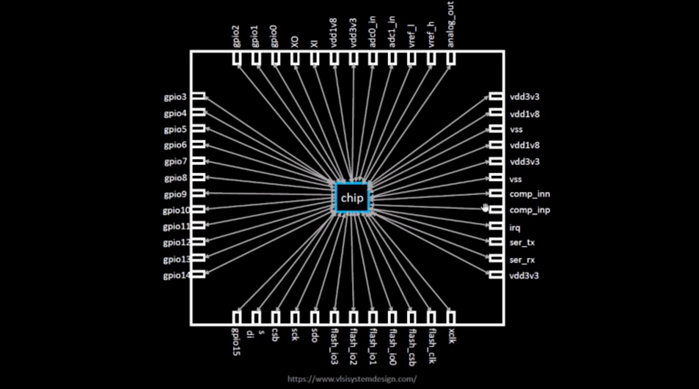

### Chip Overview

  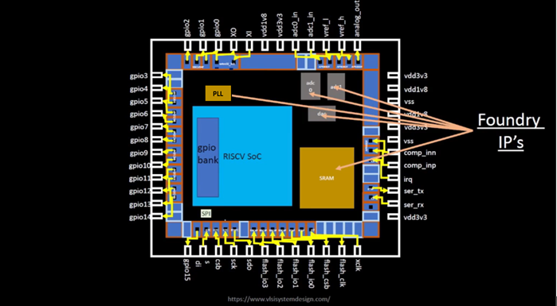

 

 
Foundry IPs are pre-designed and pre-verified blocks provided by semiconductor foundries to streamline chip design. These include critical components such as analog-to-digital converters (ADCs), digital-to-analog converters (DACs), SRAM, GPIO interfaces, and Phase-Locked Loops (PLLs).

For example, the PLL is a crucial IP block in chip design. Its primary function is to take an input clock signal (which may be of lower frequency) and generate a stable output clock signal at a higher frequency, phase-locked to the input. This is essential for processors to operate at their required high-frequency clock rates while maintaining synchronization with the input clock source.

By using foundry IPs, designers save time and effort, leveraging proven and reliable building blocks optimized for the foundry's process technology.

---

 

## Introduction to RISC-V

### RISC-V Architecture Implementation

  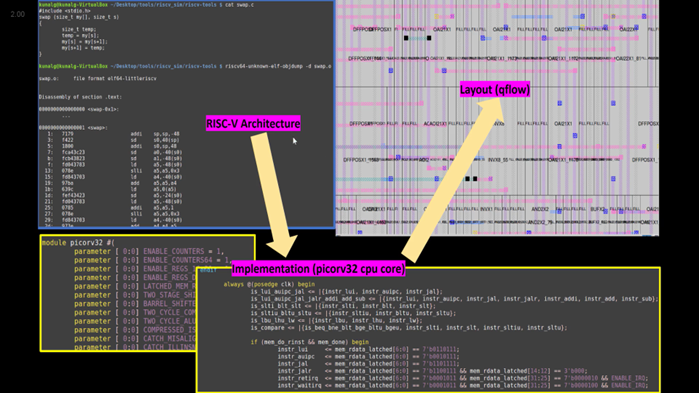

 
 
RISC-V Architecture specifications can be implemented in the Layout using a HDL.

---

 

## From Software Applications to Hardware

### Software Flow

  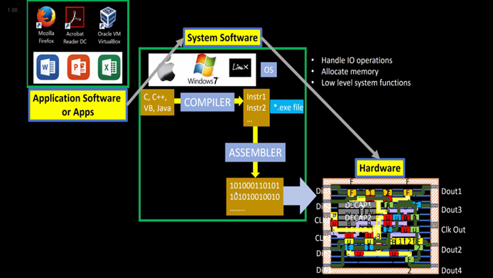

 

 
To run an application on hardware, several processes occur. The application enters the system software, which converts it into binary language. Key components of system software include the Operating System (OS), compiler, and assembler.  
 
 
The OS produces functions in high-level languages (e.g., C, C++, Java), which the compiler converts into hardware-specific instructions. These instructions are then processed by the assembler, which translates them into binary code (machine language). Finally, this binary code is fed to the hardware, enabling it to execute the required functions.

### Stopwatch App as an example

  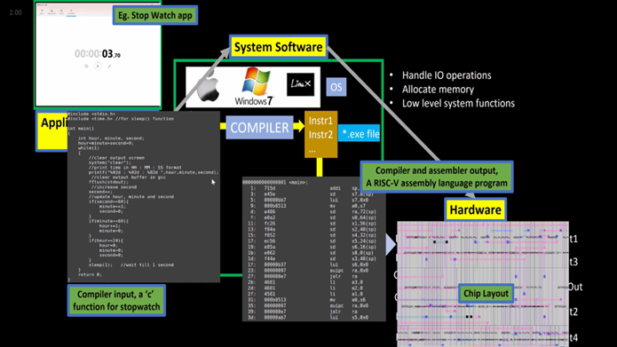

 

 
For instance, consider a stopwatch app running on a RISC-V core. The operating system generates a small C function, which is processed by the compiler to produce RISC-V instructions. These instructions are then passed through an assembler, which converts them into binary code. This binary code is subsequently loaded onto the chip's layout for execution.

### Instruction Set Architecture (ISA)

  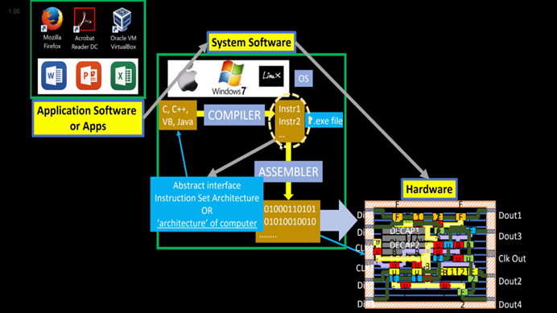

 

 
The instructions, which are part of the Instruction Set Architecture (ISA), are written in assembly language or high-level language. These are passed through an assembler (or compiler), which converts them into machine code (binary format) that the hardware can understand and execute. The RTL (Register Transfer Level) description, written in a hardware description language (e.g., Verilog or VHDL), is synthesized into a netlist (a representation of the design in terms of logic gates). This netlist is then used in the physical design process to create a layout, which represents the actual physical implementation of the circuit on silicon.

### ISA -> RTL & Synthesis -> Physical Design

  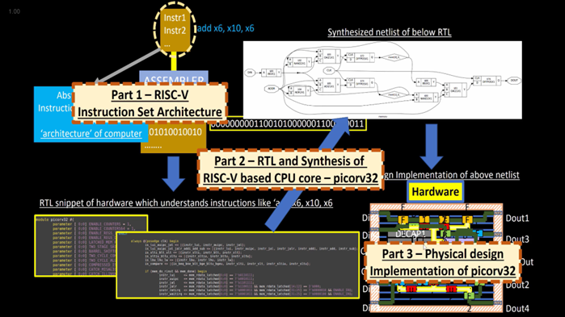

 

 
This course is divided into three distinct parts:
 

- RISC-V ISA
- RTL and synthesis of RISC-V based CPU core - picorv32
- Physical design implementation of picorv32

---

 

## Introduction to all components of open-source digital asic design

 
For open-source ASIC design implementation, we need the following enablers available in open-source versions:
 

- RTL Designs
- EDA Tools
- PDK Data
  
Initially, IC design and fabrication were closely tied and limited to companies like TI and Intel. In 1979, Lynn Conway and Carver Mead introduced the idea of separating design from fabrication by developing structured methodologies based on λ-design rules, which led to the first VLSI book, *Introduction to VLSI Systems*. This approach gave rise to "fabless" companies focused on design and "pure play fabs" for fabrication.
  
The interface between designers and fabs became a set of files called "Process Design Kits" (PDKs), which include device models, design rules, and libraries. Due to the sensitive nature of PDKs, they were previously distributed only under NDAs.
  
However, in 2020, Google collaborated with Skywater to open-source the 130nm PDK, making it the first open-source PDK release.

 

  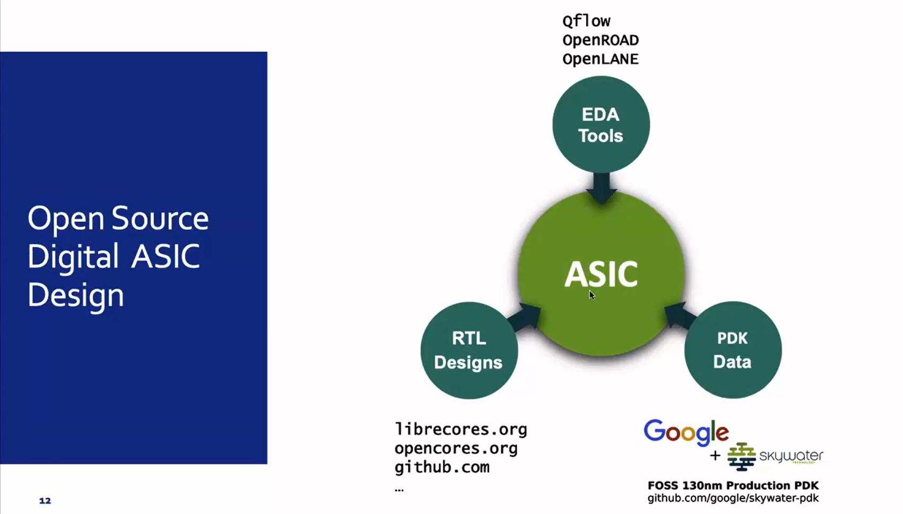

  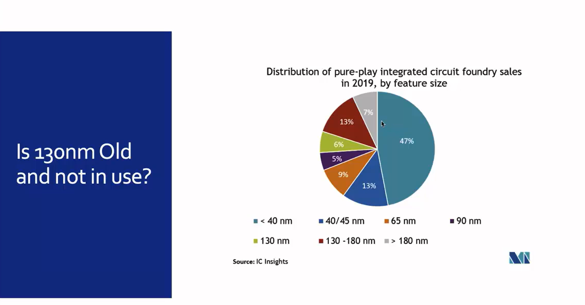

  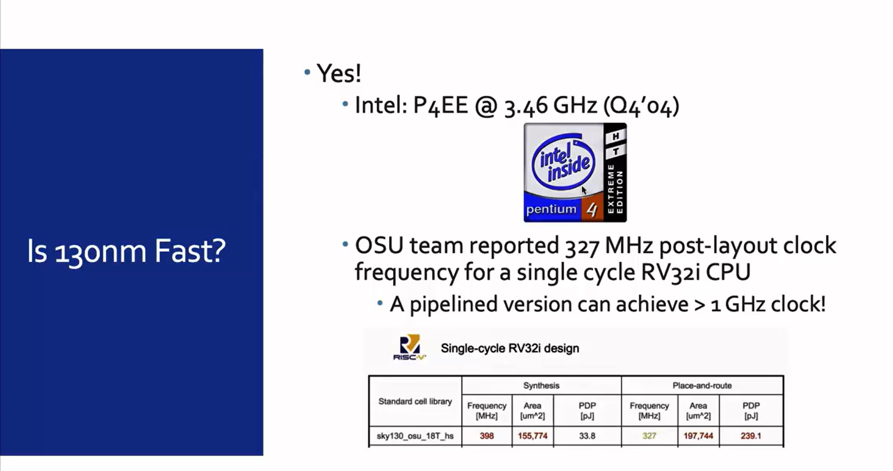

  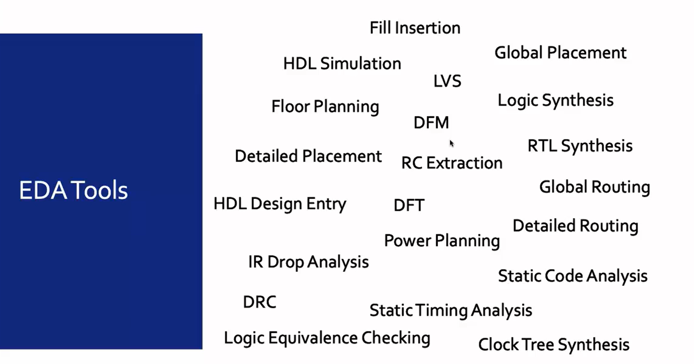

