<div align="center">

# Nasscom & VSD SOC Design and Planning

</div>


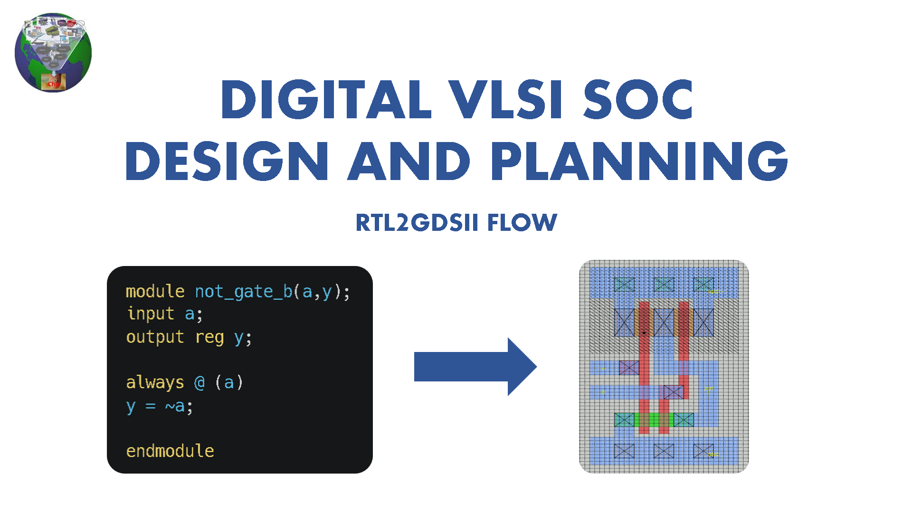
> 2 Week digital VLSI SoC design and planning workshop with complete RTL2GDSII flow organised by VSD in collaboration with NASSCOM

<p align="justify"> 

# Chip Design and Validation Workflow

An overview of the **chip design and validation workflow** from initial specifications to final applications. The workflow ensures validation consistency across all stages: **O1 = O2 = O3 = O4**.  

<details><summary> 
  
### Click to learn about the workflow stages </summary>

## **Workflow Stages**

### **O1: Specifications (C Model)**
- The design begins with defining specifications in a high-level **C model**.
- A **testbench** (in C language) is used to validate functionality early on.

---

### **O2: RTL Design (Verilog)**
- The hardware is implemented as a **soft copy** using **RTL (Verilog)**.
- Major components:
  - **Processor**
  - **Peripherals/IPs**
  - **Analog IPs**
- The design is synthesized, producing a **Gate-Level Netlist** for further validation.

---

### **O3: SoC Integration**
- Modules (processor, peripherals, macros, and analog IPs) are integrated into a **System-on-Chip (SoC)**.
- Physical design steps include:
  - **Floorplanning**
  - **Placement**
  - **Routing**
- The design undergoes:
  - **Design Rule Checks (DRC)**
  - **Layout vs. Schematic (LVS)**  
- Output: **GDSII file** for fabrication.
  
---

### **O4: Final Chip Design**
- The final chip design includes **peripherals** operating in the target frequency range.
- The **testbench** continues validating the design to ensure:
  - **O1 = O2 = O3 = O4**

---

Below are the diagrams that visually represent the chip design workflow:

### Workflow Stages (O1 to O3)
<div align="center">
  
</div>

### Final Validation and Applications (O4)
<div align="center">
  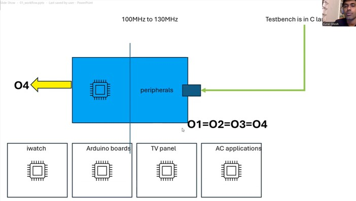
</div>
</details>
</p>

# Section 1 - Inception of open-source EDA, OpenLANE and Sky130 PDK 

<details>
<summary> 

## Introduction to QFN-48 Package, chip, pads, core, die and Ips 
</summary>

### Overview of an Embedded Board Design
<div align="center">
  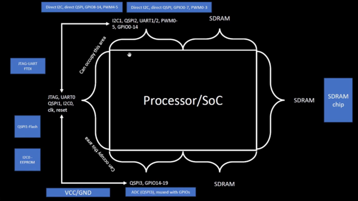
</div>

### Inside a Package
<div align="center">
  
</div>

### Connecting the chip to the pins 
<div align="center">
  
</div>

### Chip Overview
<div align="center">
  
</div>

<br />
<p align="justify"> 
Foundry IPs are pre-designed and pre-verified blocks provided by semiconductor foundries to streamline chip design. These include critical components such as analog-to-digital converters (ADCs), digital-to-analog converters (DACs), SRAM, GPIO interfaces, and Phase-Locked Loops (PLLs).

For example, the PLL is a crucial IP block in chip design. Its primary function is to take an input clock signal (which may be of lower frequency) and generate a stable output clock signal at a higher frequency, phase-locked to the input. This is essential for processors to operate at their required high-frequency clock rates while maintaining synchronization with the input clock source.

By using foundry IPs, designers save time and effort, leveraging proven and reliable building blocks optimized for the foundry's process technology.
</p>
</details>

---

<details>
<summary> 

## Introduction to RISC-V
</summary>

### RISC-V Architecture Implementation
<div align="center">
  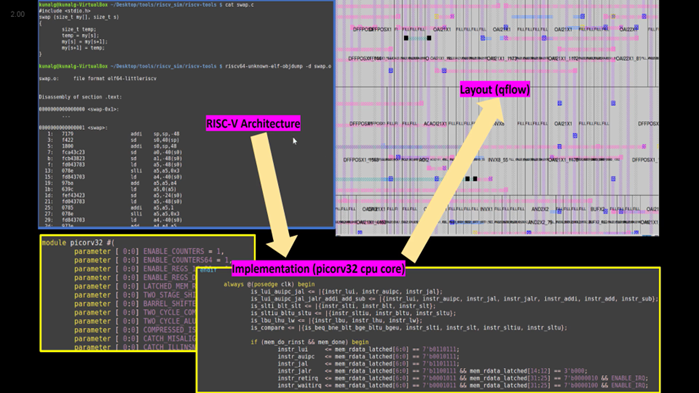
</div>
<p align="justify"> 
<br />
RISC-V Architecture specifications can be implemented in the Layout using a HDL.
</p>
</details>

---

<details>
<summary> 

## From Software Applications to Hardware
</summary>

### Software Flow
<div align="center">
  
</div>
<br />
<p align="justify"> 
To run an application on hardware, several processes occur. The application enters the system software, which converts it into binary language. Key components of system software include the Operating System (OS), compiler, and assembler.  
<br />
<br />
The OS produces functions in high-level languages (e.g., C, C++, Java), which the compiler converts into hardware-specific instructions. These instructions are then processed by the assembler, which translates them into binary code (machine language). Finally, this binary code is fed to the hardware, enabling it to execute the required functions.
</p>

### Stopwatch App as an example
<div align="center">
  
</div>
<br />
<p align="justify"> 
For instance, consider a stopwatch app running on a RISC-V core. The operating system generates a small C function, which is processed by the compiler to produce RISC-V instructions. These instructions are then passed through an assembler, which converts them into binary code. This binary code is subsequently loaded onto the chip's layout for execution.
</p>

### Instruction Set Architecture (ISA)
<div align="center">
  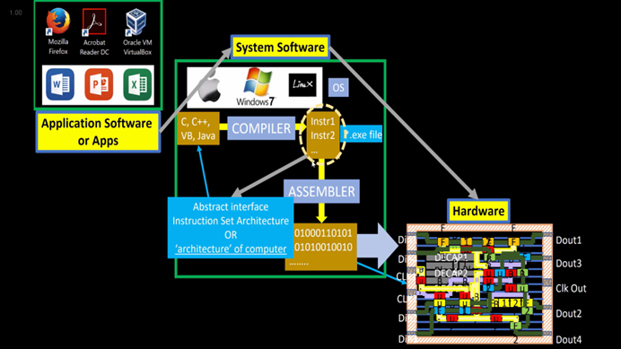
</div>
<br />
<p align="justify"> 
The instructions, which are part of the Instruction Set Architecture (ISA), are written in assembly language or high-level language. These are passed through an assembler (or compiler), which converts them into machine code (binary format) that the hardware can understand and execute. The RTL (Register Transfer Level) description, written in a hardware description language (e.g., Verilog or VHDL), is synthesized into a netlist (a representation of the design in terms of logic gates). This netlist is then used in the physical design process to create a layout, which represents the actual physical implementation of the circuit on silicon.
</p>

### ISA -> RTL & Synthesis -> Physical Design
<div align="center">
  
</div>
<br />
<p align="justify"> 
This course is divided into three distinct parts:
<br />

- RISC-V ISA
- RTL and synthesis of RISC-V based CPU core - picorv32
- Physical design implementation of picorv32
</p>
</details>

---

<details>
<summary> 

## Introduction to all components of open-source digital asic design
</summary>
<p align="justify"> 
For open-source ASIC design implementation, we need the following enablers available in open-source versions:
<br />

- RTL Designs
- EDA Tools
- PDK Data
</p>

<p align="justify"> 
Initially, IC design and fabrication were closely tied and limited to companies like TI and Intel. In 1979, Lynn Conway and Carver Mead introduced the idea of separating design from fabrication by developing structured methodologies based on λ-design rules, which led to the first VLSI book, *Introduction to VLSI Systems*. This approach gave rise to "fabless" companies focused on design and "pure play fabs" for fabrication.
<br /><br />
The interface between designers and fabs became a set of files called "Process Design Kits" (PDKs), which include device models, design rules, and libraries. Due to the sensitive nature of PDKs, they were previously distributed only under NDAs.
<br /><br />
However, in 2020, Google collaborated with Skywater to open-source the 130nm PDK, making it the first open-source PDK release.
</p>

<br />

<div align="center">
  
</div>

<br />

### Is Sky130nm still in use?
<div align="center">
  
</div>

<br />

<p align="justify"> 
The 130nm process accounts for 6% of the market share in pure-play IC foundry sales. It remains relevant due to its cost-effectiveness for applications that don't require the advanced performance of smaller nodes.
</p>

### Is Sky130nm fast?
<div align="center">
  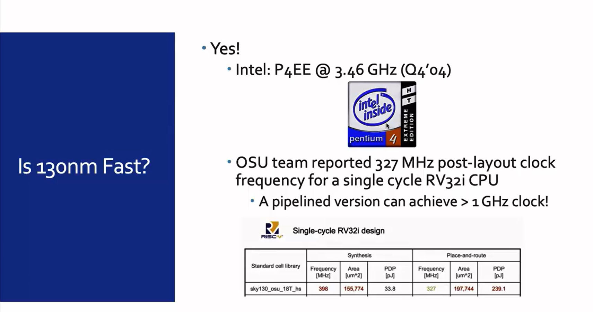
</div>

<br />

<p align="justify"> 
The 130nm process can still achieve high performance. For instance, Intel's Pentium 4 Extreme Edition ran at 3.46 GHz, and the OSU team achieved a 327 MHz clock frequency for a single-cycle RV32i CPU in post-layout simulations. A pipelined version can exceed 1 GHz. Additionally, using the Sky130 PDK, the RV32i design achieved a 398 MHz frequency with a 33.8 pJ PDP, demonstrating that 130nm can still deliver competitive speeds.
</p>

### EDA Tools
<div align="center">
  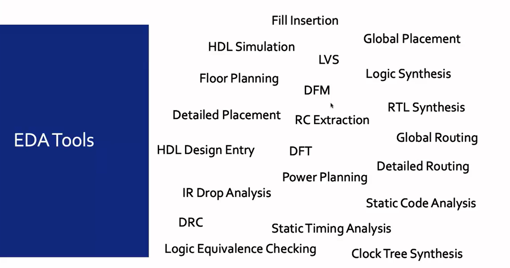
</div>

<br />

<p align="justify"> 
ASIC design is a complex process involving numerous steps, methodologies, and EDA tools. These elements are integrated into an ASIC flow, a software that combines various tools to execute the design process.
</p>
</details>

---

<details>
<summary> 

## Simplified RTL2GDS flow
</summary>

### RTL2GDS flow
<div align="center">
  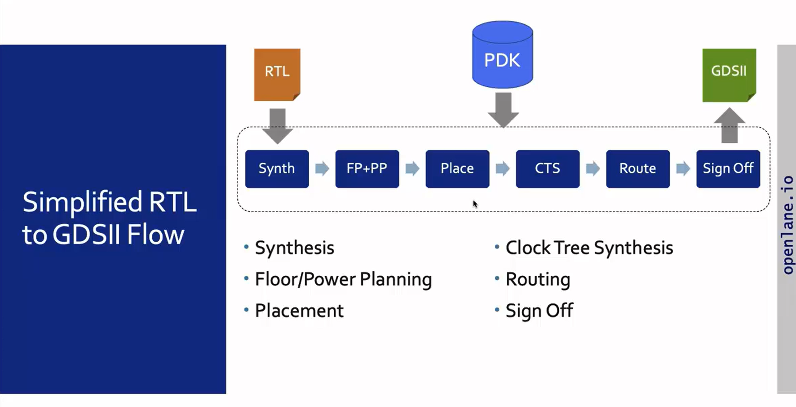
</div>
<br />

### Chip Floor Planning
<div align="center">
  
</div>
<br />

### Macro Floor Planning
<div align="center">
  
</div>
<br />

### Power Planning
<div align="center">
  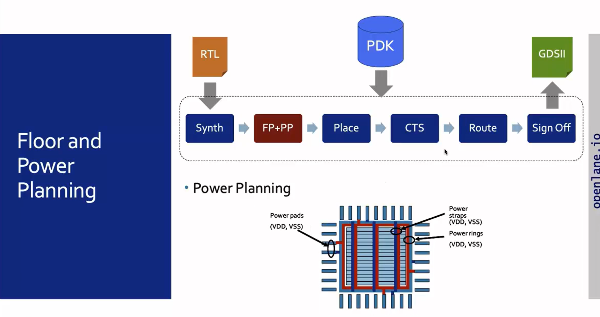
</div>
<br />

### Placement
<div align="center">
  
</div>
<br />

<div align="center">
  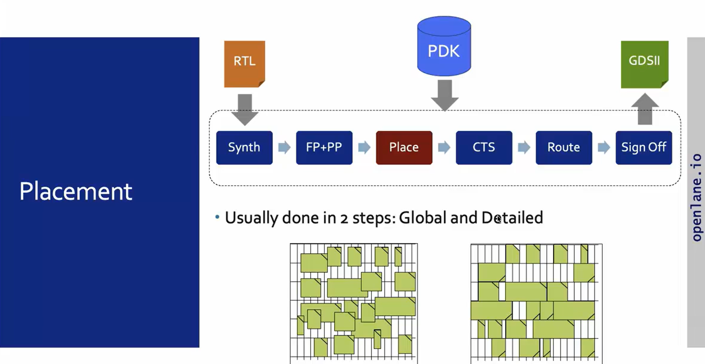
</div>
<br />

### Clock Tree Synthesis
<div align="center">
  
</div>
<br />

### Routing
<div align="center">
  
</div>
<br />

### SignOff
<div align="center">
  
</div>
<br />

</details>

---

<details>
<summary> 

## DAY 1 LAB -  Design Synthesis - picorv32a 
</summary>
<p align="justify"> 

Aim is to run 'picorv32a' design synthesis using OpenLANE flow and generate necessary outputs and then calculate the flop ratio.

### To run Design Synthesis - picorv32a using OpenLANE flow

Commands to invoke the OpenLANE flow and perform synthesis

```bash
# Navigate to the OpenLANE flow directory
cd Desktop/work/tools/openlane_working_dir/openlane

# Use the alias 'docker' for the long Docker run command
# This alias simplifies invoking the OpenLANE Docker container
docker

```
```tcl
# Launch the OpenLANE flow in interactive mode
./flow.tcl -interactive

# Load the OpenLANE package for proper functionality
package require openlane 0.9

# Prepare the design environment for 'picorv32a' by creating necessary files and directories
prep -design picorv32a

# Run synthesis for the prepared design
run_synthesis

# Exit the OpenLANE flow interface
exit

# Exit the Docker container
exit

```

#### Terminal screenshots:

<div align="center">
  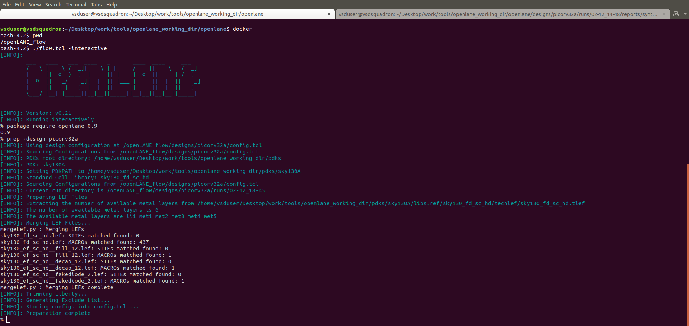
</div>
<br />

<div align="center">
  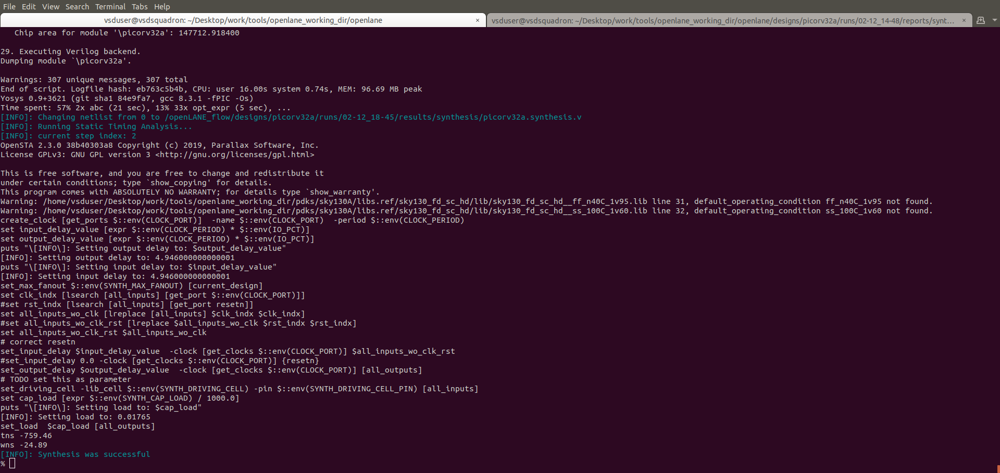
</div>
<br />

### To Calculate Flip Flop Ratio

#### Formulae:

```math
Flop\ Ratio = \frac{Number\ of\ D\ Flip\ Flops}{Total\ Number\ of\ Cells}
```
<br />

```math
Percentage\ of\ DFF's = Flop\ Ratio * 100
```
<br />

#### Terminal screenshots:

<div align="center">
  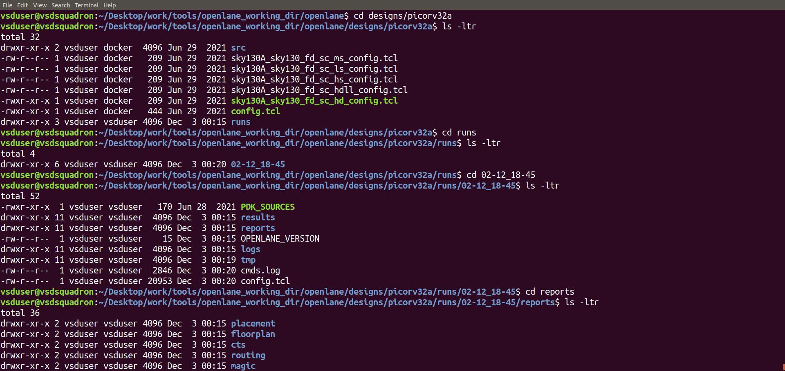
</div>
<br />

<div align="center">
  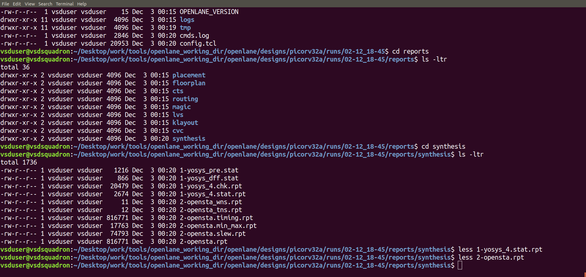
</div>
<br />

#### Highlighted Values for computation:

<div align="center">
  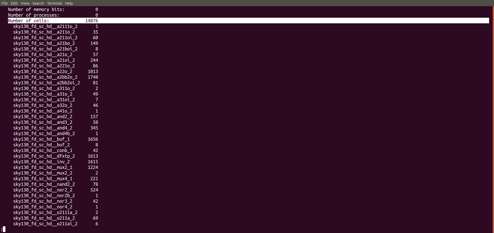
</div>
<br />

<div align="center">
  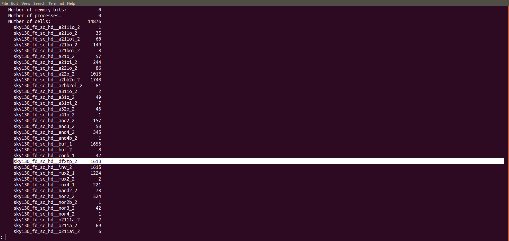
</div>
<br />

#### Calculation of Flop Ratio and DFF % from synthesis statistics report file:
<br />

```math
Flop\ Ratio = \frac{1613}{14876} = 0.108429
```
<br />

```math
Percentage\ of\ DFF's = 0.108429 * 100 = 10.8429\ \%
```
<br />

All picorv32a logs, reports and results can be found here:

[Section 1 Run - 02-12_18-45](https://github.com/rmahathi/nasscom-soc-design-and-planning/tree/main/02-12_18-45)

</p>
</details>
<br />

# Section 2 - Good floorplan vs bad floorplan and introduction to library cells

<details>
<summary> 

## Chip Floor Planning Considerations
</summary>

### 1. Identifying the Width of the Die and Core
<br />

<div align="center">
  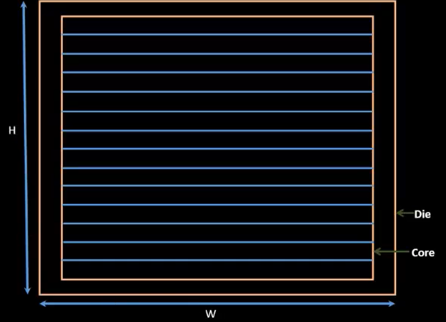
</div>
<br />

<p align="justify"> 

To determine the Utilization Factor and Aspect Ratio, the height and width of core and die areas must first be defined.

- Core is the area in a chip used for placing all the logic cells and components. It is where the logic resides in a chip.

- Die is the area encircling the core, used for placing I/O-related components.  

The height and width of the core area depend on the design's netlist. These are based on the number of components required to execute the logic. The die area's height and width depend on the core's dimensions.  

</p>

<div align="center">
  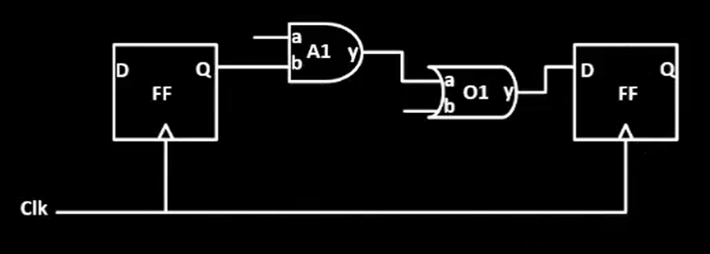
</div>
<br />

For example, consider a netlist with two logic gates and two flip-flops, each with an area of 1 sq. unit. The total core area required is 4 sq. units.  

<div align="center">
  
</div>
<br />

Area occupied by the above netlist on a silicon wafer

<div align="center">
  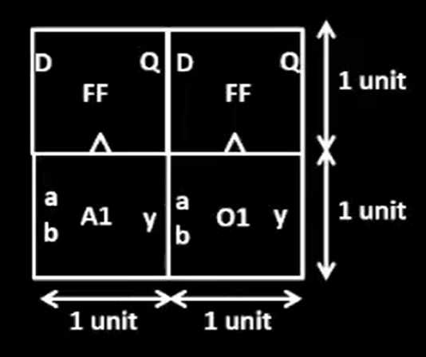
</div>
<br />

#### Utilization Factor 
Utilization Factor is the ratio of the core area occupied by the netlist to the total core area.  
For a good FloorPlan, the Utilization Factor should never be '1' to allow space for additional logic.  

```math
Utilization\ Factor = \frac{Area\ occupied\ by\ netlist}{Total\ core\ area}
```

#### Aspect Ratio 
Aspect Ratio is the ratio of the core's height to its width.  
If the Aspect Ratio is '1', the core is square. Otherwise, it is rectangular.  

```math
Aspect\ Ratio = \frac{Height\ of\ the\ core}{Width\ of\ the\ core}
```

#### Calculations
 
<div align="center">
  
</div>
<br />

```math
Utilization\ Factor = \frac{4\ sq.\ units}{4\ sq.\ units} = 1
```

```math
Aspect\ Ratio = \frac{2\ units}{2\ units} = 1\ (Square\ core)
```

### 2. Define Locations of Pre-Placed Cells

Pre-placing cells refers to reusing pre-designed blocks (e.g., memory, comparators, MUX). These blocks are called macros or IPs.  

<div align="center">
  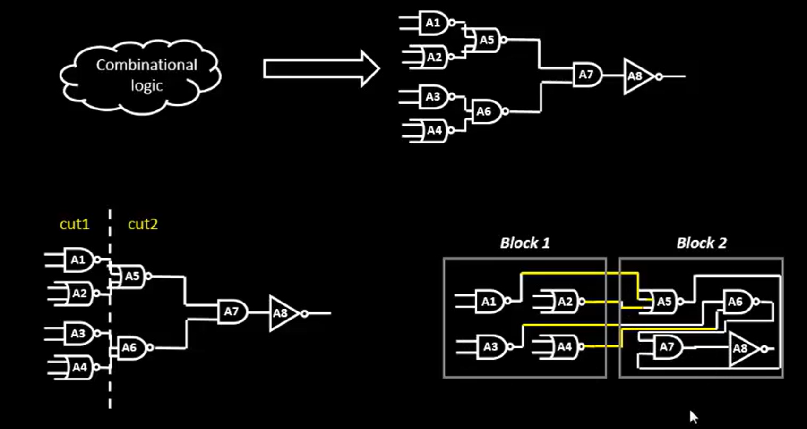
</div>
<br />

<div align="center">
  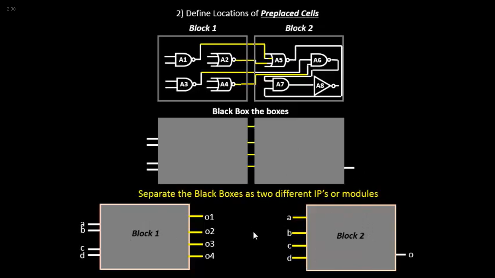
</div>
<br />

<div align="center">
  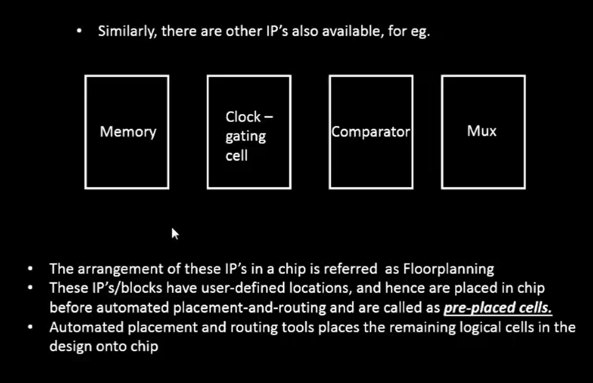
</div>
<br />

Macros should be placed close to input pins for reduced wiring length. They are placed during the Floorplan stage, with placement blockages defined to prevent standard cells from being placed nearby, and they also reduce Time-to-Market.  

### 3. Surround Pre-Placed cells with De-Coupling Capacitors
<br />

<div align="center">
  
</div>
<br />
<p align="justify"> 
Decoupling capacitors are used in SoC design near high-power-demanding blocks or macros to stabilize voltage by locally storing charge. They charge when signals switch from 0 to 1 and supply energy during peak current demands, reducing the reliance on distant power sources. The power supply wires have inherent resistance and inductance, which cause a voltage drop during current flow, leading to a slightly reduced voltage at the load (Vdd' < Vdd). This voltage drop becomes more pronounced over larger physical distances, making it difficult to maintain stable voltage levels. 
</p>
<div align="center">
  
</div>
<br />

If the drop pushes the voltage below the noise margin, the circuit may enter an undefined state, resulting in failures or incorrect outputs. 

<div align="center">
  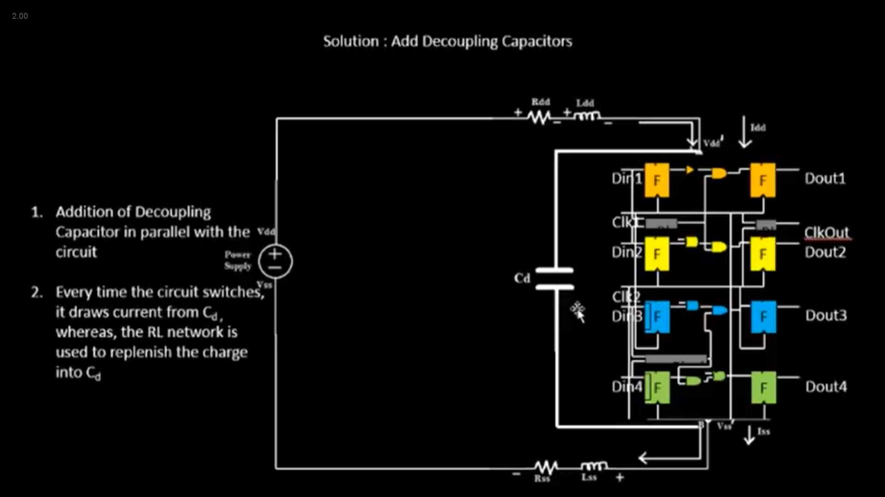
</div>
<br />

Decoupling capacitors mitigate this by supplying the required energy locally during switching, ensuring stable operation and preventing voltage drops from falling below safe levels.

<div align="center">
  
</div>
<br />

### 4. Power Planning 

In power planning for SoC design, consider a macro where a 16-bit orange bus carries a 0-to-1 signal. Being far from the power source introduces voltage drops due to resistance and inductance in the supply wires.

<div align="center">
  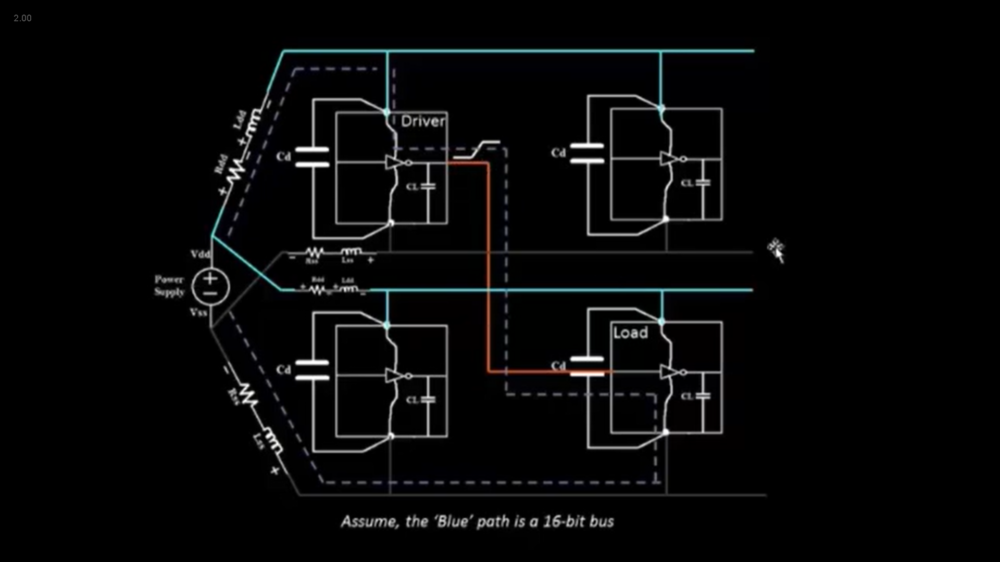
</div>
<br />

To handle signal transitions, drivers (e.g., inverters) are employed. An inverter converts the input signal to its complement (0 to 1 or 1 to 0), driving the next stage effectively.

<div align="center">
  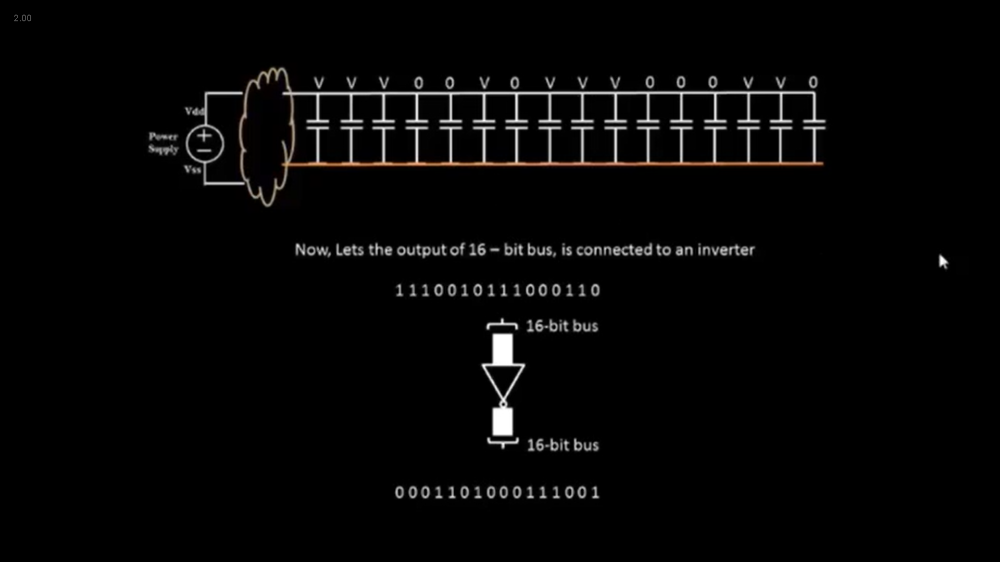
</div>
<br />

1-to-0 Transition - Ground Bounce:

In a 1-to-0 transition, the previously charged nodes discharge rapidly to ground. If all 16 bits discharge at once, the ground potential may fluctuate, causing a phenomenon called ground bounce. This occurs due to inductance in the ground path, leading to temporary voltage spikes. If the ground bounce crosses the noise margin, it can cause unpredictable behavior, further increasing the risk of errors in circuit operation.

<div align="center">
  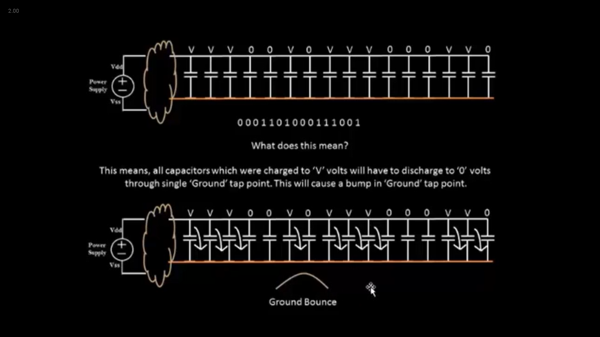
</div>
<br />

0-to-1 Transition - Voltage Drop:

When a 0-to-1 transition occurs, the driver charges the load capacitance of the connected circuit. This charging demands significant current, especially for all 16 bits transitioning simultaneously. A voltage drop across the supply wires may occur due to the high current demand, reducing Vdd' and risking a voltage level near or below the noise margin. If the voltage drops significantly, the circuit can enter an undefined state, leading to unreliable outputs.

<div align="center">
  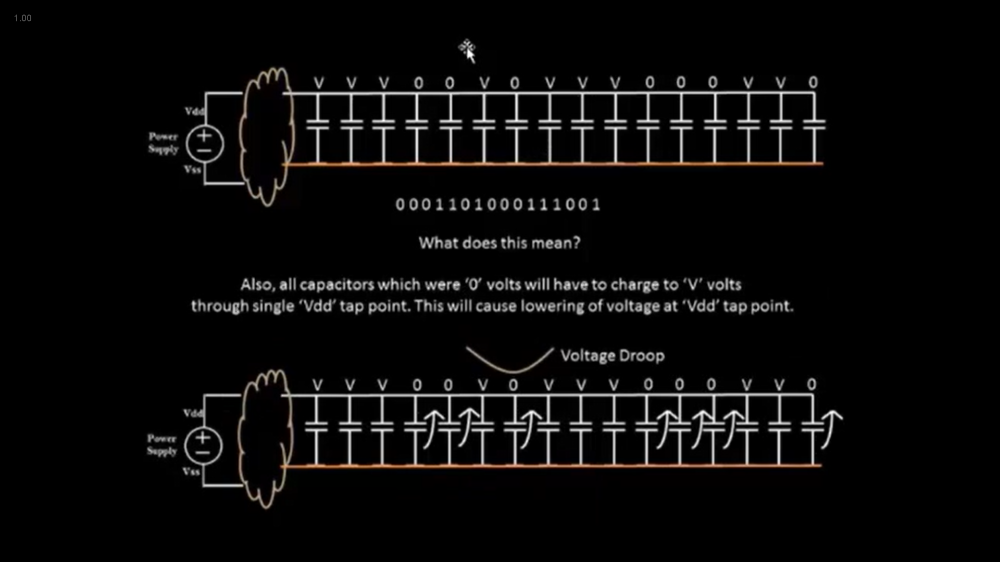
</div>
<br />

Simultaneous Switching Problem:

When multiple signals (0-to-1 or 1-to-0) switch at the same time, the cumulative current demand rises sharply. For a 0-to-1 transition, the power supply must provide a surge of current to charge the capacitors, while for a 1-to-0 transition, a large discharge current flows to ground. Both cases can result in severe voltage drops or ground bounce due to the limitations of a single-point power supply.

<div align="center">
  
</div>
<br />

Solution: Power Mesh
The solution is to replace the single-point power supply with a power mesh. A power mesh distributes Vdd and ground throughout the chip using a network of interconnected wires, reducing the resistance and inductance between the source and various blocks. By bringing power closer to the loads and reducing the effective distance, the voltage drop and ground bounce are minimized. The power mesh ensures that all parts of the circuit can access stable supply and ground levels, even during peak current demands, maintaining signal integrity and preventing undefined states.

<div align="center">
  
</div>
<br />

### 5. Pin Placement 

Pin placement impacts wire length and connectivity. Pins must be placed to minimize wire length.  
For example, an input pin driving two blocks should be near them.  

<div align="center">
  
</div>
<br />

In effective pin placement:  
1. Pin order is based on connectivity, not sequence.  
2. Clock pins are larger due to their importance and susceptibility to delays.  

<div align="center">
  
</div>
<br />

### 6. Logical Cell Placement Blockage

Placement blockages outside the core and inside the die prevents automated placement and routing tool from placing any other cells into the the pin-dedicated area.

<div align="center">
  
</div>
<br />

</details>

---

<details>
<summary> 

## DAY 2 LAB -  Design Floorplan- picorv32a 

</summary>

<p align='justify'>
Before initiating the floorplan stage, designers must verify and adjust crucial switches that control the floorplan's characteristics. These configuration parameters, including utilization factor and aspect ratio, must align with the project's specific requirements to ensure optimal floorplan execution. A proper review of these switches helps prevent potential issues and ensures the floorplan process proceeds as intended.
</p>

<div align="center">
  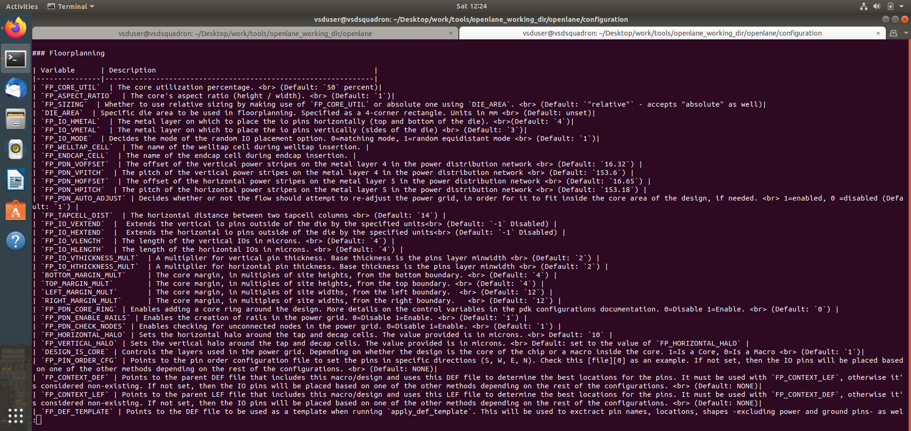
</div>
<br />
<div align="center">
  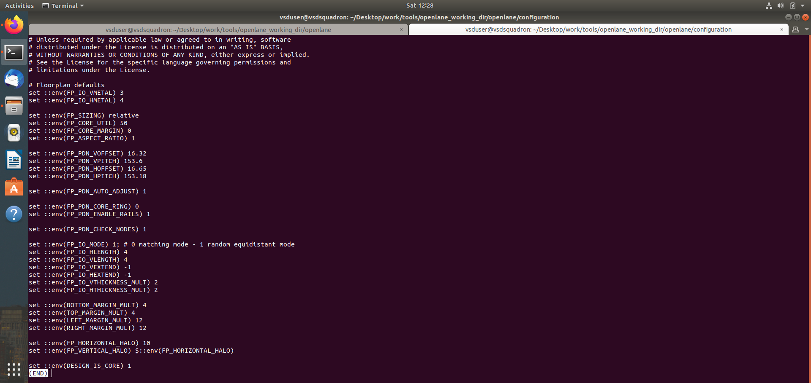
</div>
<br />
<div align="center">
  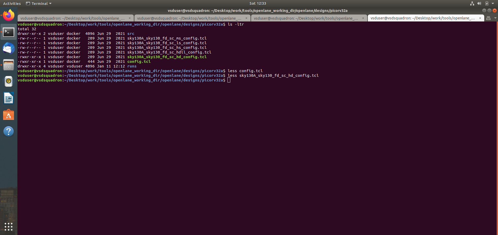
</div>
<br />
<div align="center">
  
</div>
<br />
<div align="center">
  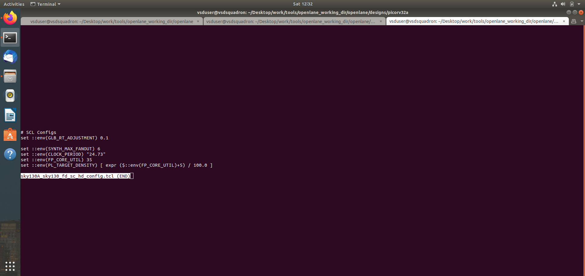
</div>
<br />

### To run Design Floorplan - picorv32a using OpenLANE flow

Commands to invoke the OpenLANE flow and run floorplan

```bash
# Navigate to the OpenLANE flow directory
cd Desktop/work/tools/openlane_working_dir/openlane

# Use the alias 'docker' for the long Docker run command
# This alias simplifies invoking the OpenLANE Docker container
docker

```
```tcl
# Launch the OpenLANE flow in interactive mode
./flow.tcl -interactive

# Load the OpenLANE package for proper functionality
package require openlane 0.9

# Prepare the design environment for 'picorv32a' by creating necessary files and directories
prep -design picorv32a

# Run synthesis for the prepared design
run_synthesis

# Initialize the floorplan for the design
init_floorplan

# Place the IO pins in the design
place_io

# Insert tap cells and decoupling capacitors
tap_decap_or

# Generate the power grid
run_power_grid_generation

# Perform detailed floorplanning after power grid generation
run_floorplan

```
<br />
<div align="center">
  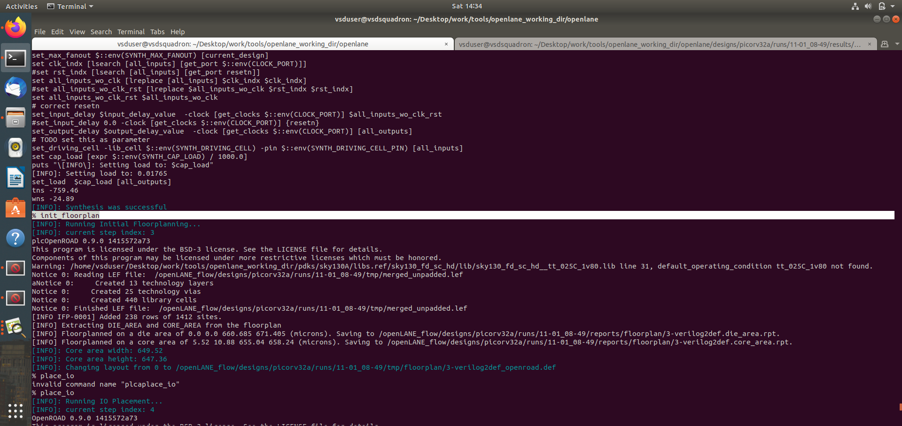
</div>
<br />
<div align="center">
  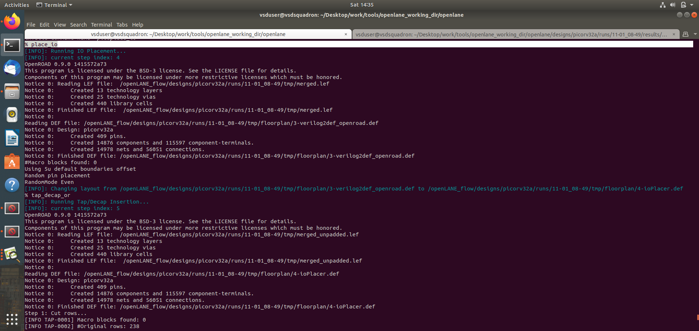
</div>
<br />
<div align="center">
  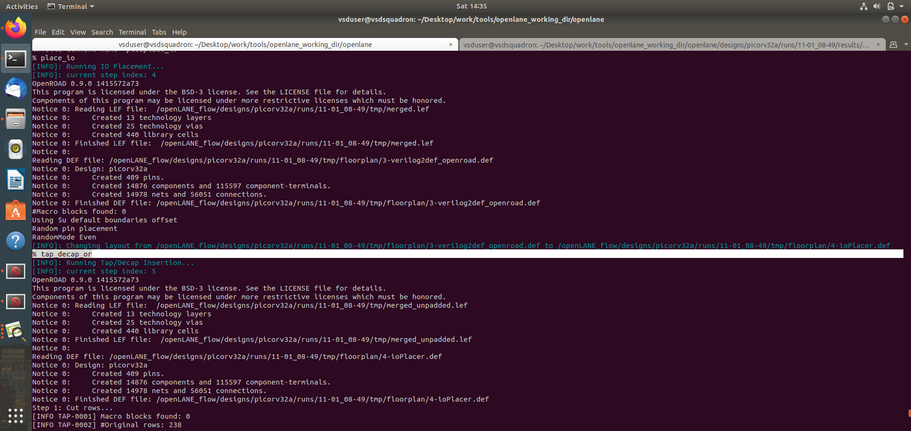
</div>
<br />
<div align="center">
  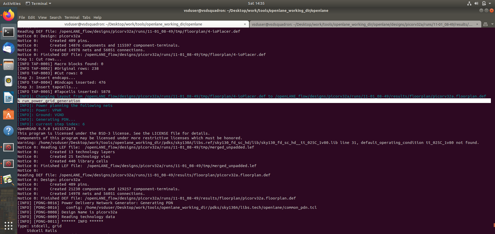
</div>
<br />
<div align="center">
  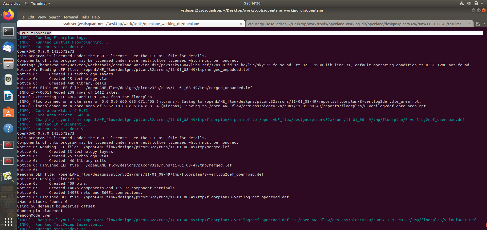
</div>
<br />
<div align="center">
  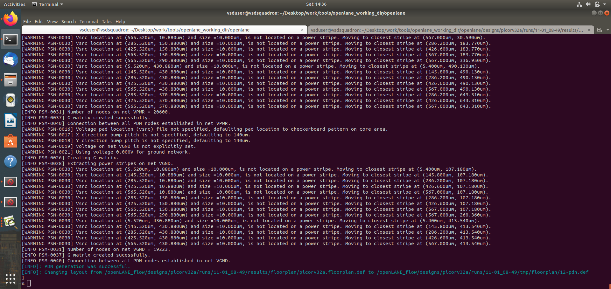
</div>
<br />
<br />
<div align="center">
  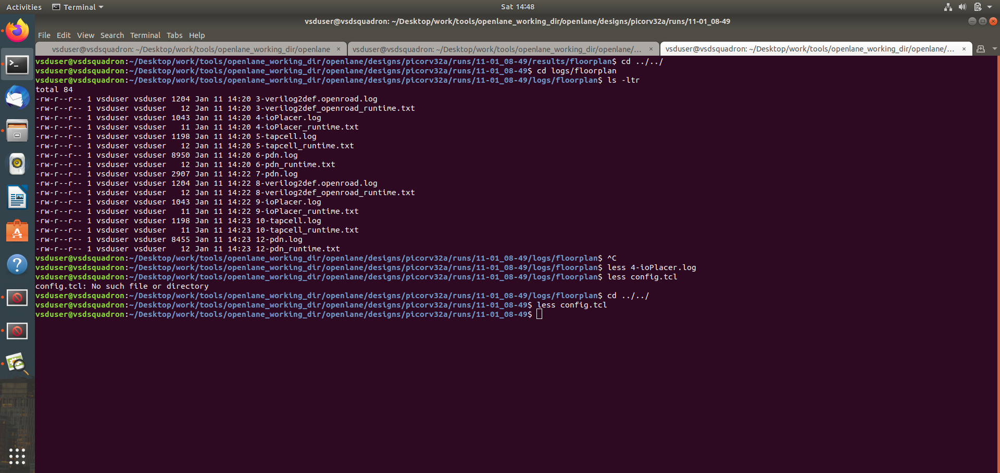
</div>
<br />
<div align="center">
  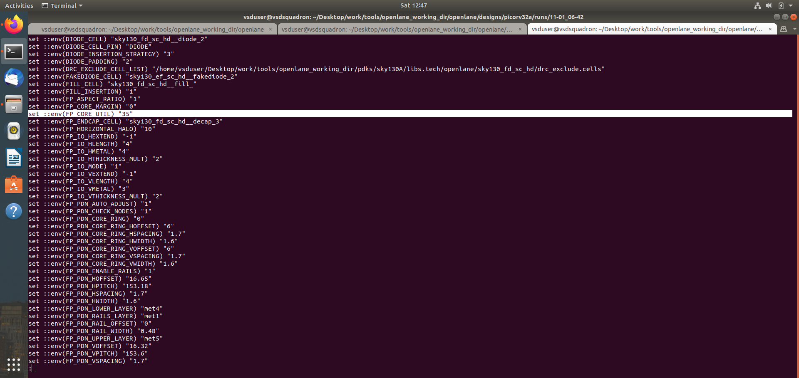
</div>
<br />

Steps to Open Magic

```
magic -T /home/vsduser//Desktop/work/tools/openlane_working_dir/pdks/sky130A/libs.tech/magic/sky130A.tech lef read ../../tmp/merged.lef def read picorv32a.floorplan.def &
```
<br />
<div align="center">
  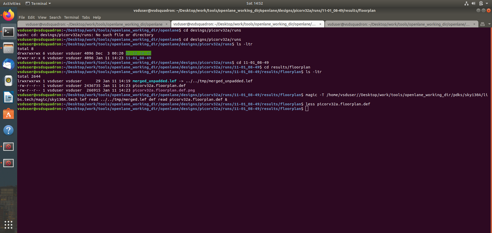
</div>
<br />
<div align="center">
  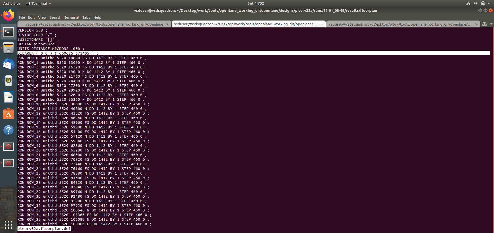
</div>
<br />

### Calculate the die area in microns from the values in floorplan def.

```math
1000\ Unit\ Distance = 1\ Micron
```

```math
Die\ width\ in\ unit\ distance = 660685 - 0 = 660685 
```
  
```math
Die\ height\ in\ unit\ distance = 671405 - 0 = 671405
```

```math
Distance\ in\ microns = \frac{Value\ in\ Unit\ Distance}{1000}
```

```math
Die\ width\ in\ microns = \frac{660685}{1000} = 660.685\ Microns
```

```math
Die\ height\ in\ microns = \frac{671405}{1000} = 671.405\ Microns
```

```math
Area\ of\ die\ in\ microns = 660.685 * 671.405 = 443587.212425\ Square\ Microns
```

<br />
<div align="center">
  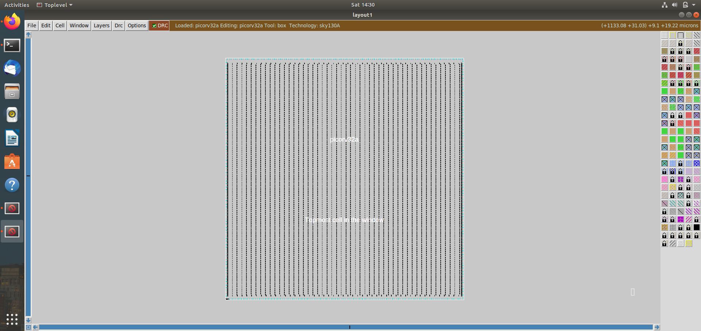
</div>
<br />
<div align="center">
  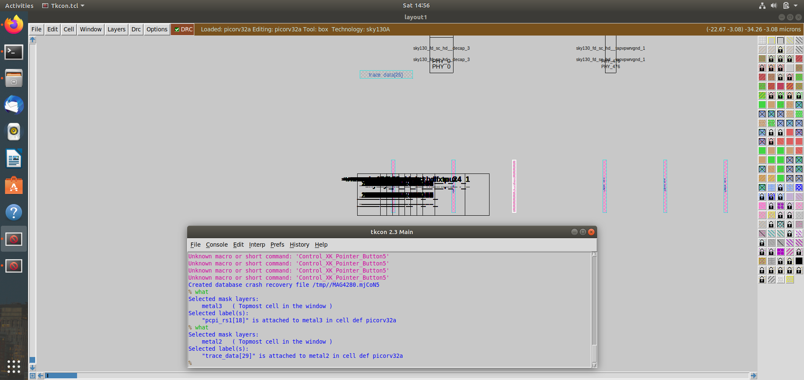
</div>
<br />

All picorv32a logs, reports and results can be found here:

[Section 2 Run - 11-01_08-49)](https://github.com/rmahathi/nasscom-soc-design-and-planning/tree/main/11-01_08-49)

</details>

---

<details>
<summary> 

## Library Binding and Placement
</summary>

<div align="center">
  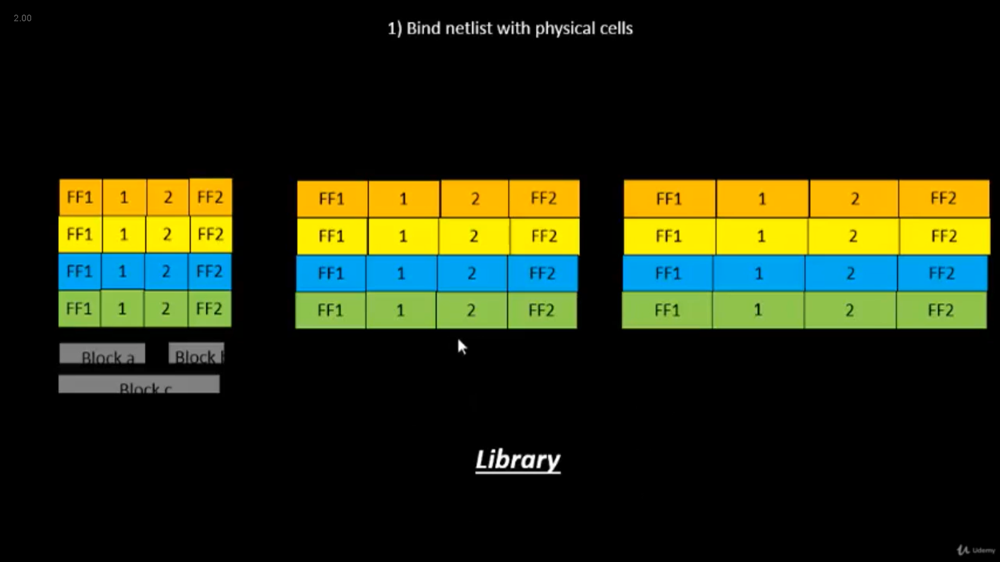
</div>
<br />

<div align="center">
  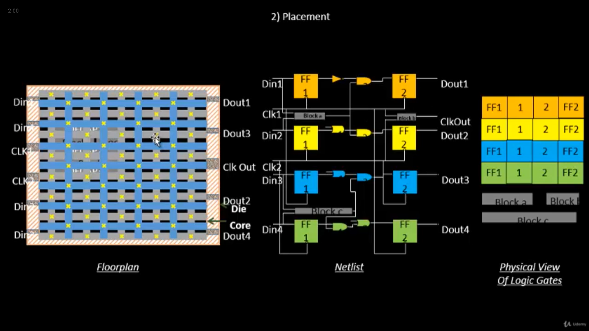
</div>
<br />

<div align="center">
  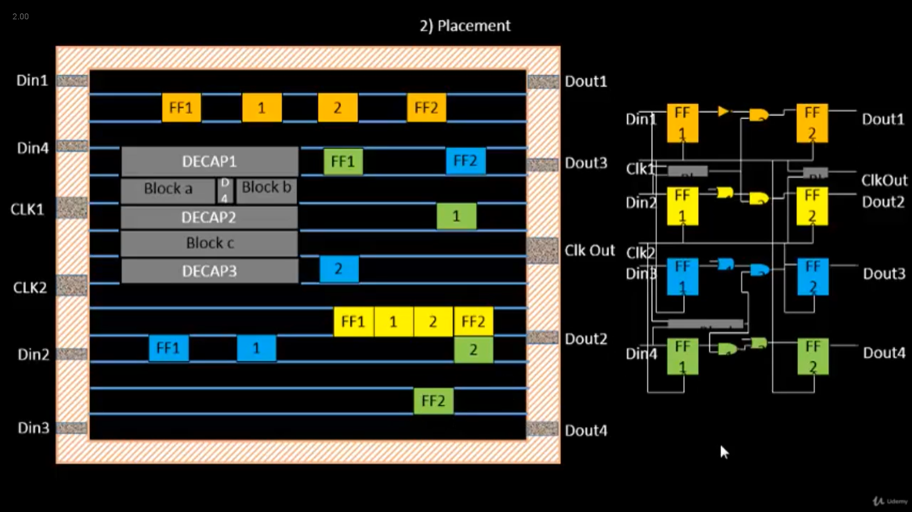
</div>
<br />

Repeaters, also known as buffers, are essential components in digital designs to recondition and regenerate signals, 
ensuring that they maintain their integrity over long distances. These buffers help replicate the original signal and send 
it again without degradation. In the placement process, buffers are strategically placed based on slew analysis to optimize 
signal quality and timing, preventing signal degradation or delays. This ensures the overall performance of the design by 
maintaining proper signal strength and timing across the chip.
<br />

<div align="center">
  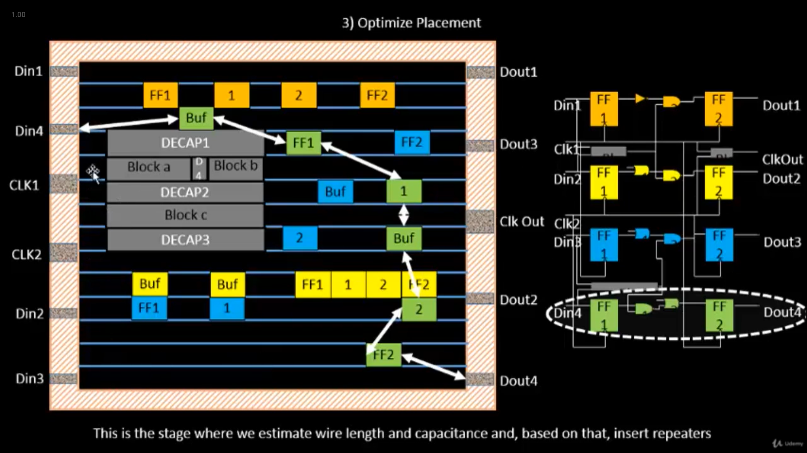
</div>
<br />

<div align="center">
  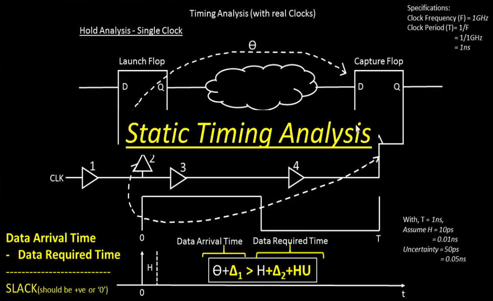
</div>
<br />

</details>

---

<details>
<summary> 

## DAY 2 LAB -  Design Placement- picorv32a 

</summary>

### To run Design Placement - picorv32a using OpenLANE flow

Commands to invoke the OpenLANE flow and run placement

```tcl
# Previous section sets up the design environment for 'picorv32a'
# Performs synthesis to generate a gate-level netlist
# Initializes the floorplan, places IO pins, inserts tap cells and decoupling capacitors, generates the power grid, and completes the detailed floorplanning process to prepare the design for placement and routing.

# Perform global placement
run_placement

```

<div align="center">
  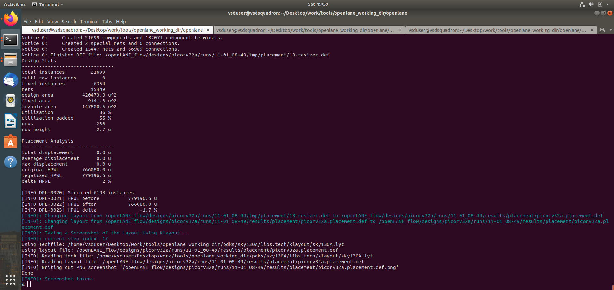
</div>
<br />

<div align="center">
  
</div>
<br />

Steps to Open Magic

```
magic -T /home/vsduser//Desktop/work/tools/openlane_working_dir/pdks/sky130A/libs.tech/magic/sky130A.tech lef read ../../tmp/merged.lef def read picorv32a.placement.def &
```

<div align="center">
  
</div>
<br />

<div align="center">
  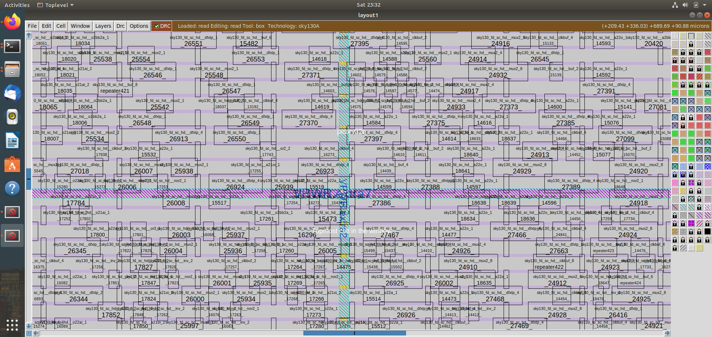
</div>
<br />

<div align="center">
  
</div>
<br />

</details>

---

<details>
<summary> 

## Cell design and characterization flows

</summary>

### Cell Design Flow

<br />
<div align="center">
  
</div>
<br />
<br />
<div align="center">
  
</div>
<br />
<br />
<div align="center">
  
</div>
<br />

### Inputs

- DRC & LVS Rules 

<br />
<div align="center">
  
</div>
<br />

- SPICE Models

<br />
<div align="center">
  
</div>
<br />

- Library & User Defined Specifications

<br />
<div align="center">
  
</div>
<br />
<br />
<div align="center">
  
</div>
<br />
<br />
<div align="center">
  
</div>
<br />
<br />
<div align="center">
  
</div>
<br />
<br />
<div align="center">
  
</div>
<br />

### Design 

- Circuit Design

<br />
<div align="center">
  
</div>
<br />

- Layout Design

<br />
<div align="center">
  
</div>
<br />

- Characterization Flow

  <b>STEP 1: Read in the Model Files</b><br>
Load the necessary model files (such as process libraries, PDK files, or any predefined models) that are required for the characterization of the cells.<br><br>
  <b>STEP 2: Read the Extracted SPICE Netlist</b><br>
Import the SPICE netlist generated for the design, which contains the circuit elements (such as transistors, resistors, capacitors) and their connections.<br><br>
  <b>STEP 3: Recognize the Behavior of the Buffer</b><br>
Identify and analyze the behavior of the buffer cells in the netlist, focusing on how they condition and regenerate the signal.<br><br>
  <b>STEP 4: Read Subcircuits of the Inverter</b><br>
Extract and analyze the subcircuits related to inverters (which are often used for logic operations in the library) to model their performance accurately.<br><br>
  <b>STEP 5: Attach Necessary Power Sources</b><br>
Ensure that the power sources (such as VDD, ground) are connected correctly to the cells and subcircuits, enabling proper functionality during simulations.<br><br>
  <b>STEP 6: Apply the Stimulus</b><br>
Apply test stimulus (input signals) to the buffer and inverter cells, simulating realistic input conditions like rising and falling edges, transitions, and signal patterns.<br><br>
  <b>STEP 7: Provide Necessary Output Capacitances</b><br>
Define the output capacitances that are connected to the output of the cells to simulate the load conditions for the buffer and inverter circuits.<br><br>
  <b>STEP 8: Provide Necessary Simulation Commands</b><br>
Set up and run the necessary simulation commands (e.g., .tran for transient analysis) to obtain results like delays, rise/fall times, and power consumption.<br><br>

<br />
<div align="center">
  
</div>
<br />


</details>

---

<details>
<summary> 

## General timing characterization parameters

</summary>

### Characterization Setup

<br />
<div align="center">
  
</div>
<br />

### 1. Timing Threshold

### Slew Rate Thresholds
The slew rate defines the rate of change of a signal's voltage level. Thresholds for rising and falling transitions help quantify the slew rate by identifying specific voltage levels at which these transitions begin and end.

<b>slew_low_rise_thr (Lower Threshold for Rising Signal Transition):</b><br />
Represents the lower bound of the rising edge of a signal transition, commonly set to 20% of the signal's maximum amplitude (from 0). This point is where the signal starts to significantly rise.

<div align="center">
  
</div>
<br />

<b>slew_high_rise_thr (Upper Threshold for Rising Signal Transition):</b><br />
Represents the upper bound of the rising edge of a signal transition, commonly set to 80% of the signal's maximum amplitude. This point is where the signal has nearly completed its rise.

<div align="center">
  
</div>
<br />

<b>slew_low_fall_thr (Lower Threshold for Falling Signal Transition):</b><br />
Represents the lower bound of the falling edge of a signal transition, commonly set to 20% of the signal's maximum amplitude. This point indicates where the signal starts to significantly fall.

<div align="center">
  
</div>
<br />

<b>slew_high_fall_thr (Upper Threshold for Falling Signal Transition):</b><br />
Represents the upper bound of the falling edge of a signal transition, commonly set to 80% of the signal's maximum amplitude. This point indicates where the signal has almost completed its fall.

<div align="center">
  
</div>
<br />

### Input Signal Thresholds

<b>in_rise_thr (Threshold for Input Signal Rising Edge):</b><br />
Represents the threshold level for the input signal's rising edge, typically set to 50% of the signal's maximum amplitude. This point is used for accurate timing analysis of the input transition.

<div align="center">
  
</div>
<br />

<b>in_fall_thr (Threshold for Input Signal Falling Edge):</b><br />
Represents the threshold level for the input signal's falling edge, typically set to 50% of the signal's maximum amplitude. This point is used to determine the critical timing of the input descent.

<div align="center">
  
</div>
<br />

### Output Signal Thresholds

<b>out_rise_thr (Threshold for Output Signal Rising Edge):</b><br />
Represents the threshold level for the output signal's rising edge, typically set to 50% of the signal's maximum amplitude. This point is crucial for measuring propagation delays and output transition timing.

<div align="center">
  
</div>
<br />

<b>out_fall_thr (Threshold for Output Signal Falling Edge):</b><br />
Represents the threshold level for the output signal's falling edge, typically set to 50% of the signal's maximum amplitude. This point is used to measure the timing when the output signal is transitioning downward.

<div align="center">
  
</div>
<br />

### 2. Propagation Delay 

```math
\mathbf{Delay} = \text{time(out\_fall\_thr)} - \text{time(in\_rise\_thr)}
```

<br />
<div align="center">
  
</div>
<br />

A negative propagation delay can occur when the output signal changes before the input signal reaches its threshold. This can happen if a higher, incorrect threshold is chosen for the input signal, as it fails to account for the actual timing relationship, leading to skewed or misleading delay calculations.
<div align="center">
  
</div>
<br />

Negative delay can occur even with the correct 50% threshold if the input signal has a high slew rate. This is because the steep input transition skews the timing relationship, causing the output to react faster or appear delayed incorrectly. Proper slew rate control is crucial for accurate timing analysis.

<div align="center">
  
</div>
<br />

<div align="center">
  
</div>
<br />

### 3. Transition Time

### Transition Time (Rise)
Transition time for a rising edge refers to the time taken by a signal to change from a low voltage level to a high voltage level. It is a critical parameter in digital circuits, impacting the speed at which signals propagate through logic gates and affecting overall circuit performance.

```math
\mathbf{\text{Transition Time (Rise)}} = \text{time(slew\_high\_rise\_thr)} - \text{time(slew\_low\_rise\_thr)}
```

### Transition Time (Fall)
Transition time for a falling edge is the time it takes for a signal to change from a high voltage level to a low voltage level. Like the rise transition time, the fall transition time plays a significant role in the timing characteristics and performance of digital circuits, influencing how quickly signals can switch between states.

```math
\mathbf{\text{Transition Time (Fall)}} = \text{time(slew\_high\_fall\_thr)} - \text{time(slew\_low\_fall\_thr)}
```
<br />
<div align="center">
  
</div>
<br />

</details>

---

# Section 3 - Design library cell using Magic Layout and ngspice characterization

<details>
<summary> 

## DAY 3 LAB - Using the IO placer to change the distance between tap cells
</summary>

```bash

# Set IO mode to 2 (unequally spaced pins)
set ::env(FP_IO_MODE) 2

# Execute floorplanning again
run_floorplan

```

<div align="center">
  
</div>
<br />

<div align="center">
  
</div>
<br />

<div align="center">
  
</div>
<br />

<div align="center">
  
</div>
<br />

</details>

---

<details>
<summary> 

## CMOS inverter ngspice theory
</summary>

<br />
<div align="center">
   
</div>

<div align="center">
  
</div>

<div align="center">
  
</div>

<div align="center">
  
</div>

<div align="center">
  
</div>

<div align="center">
  
</div>

<div align="center">
  
</div>

<div align="center">
  
</div>

<div align="center">
  
</div>

<div align="center">
  
</div>

<div align="center">
  
</div>

<div align="center">
  
</div>

<div align="center">
  
</div>

<div align="center">
  
</div>

<div align="center">
  
</div>

<div align="center">
  
</div>

<div align="center">
  
</div>

<div align="center">
  
</div>

<div align="center">
  
</div>

<div align="center">
  
</div>

<div align="center">
  
</div>

</details>

---

<details>
<summary> 

## DAY 3 LAB - Clone custom inverter standard cell design from github repository
</summary>

```bash
# Change directory to openlane
cd Desktop/work/tools/openlane_working_dir/openlane

# Clone the repository with custom inverter design
git clone https://github.com/nickson-jose/vsdstdcelldesign

# Change into repository directory
cd vsdstdcelldesign

# Copy magic tech file to the repo directory for easy access
cp /home/vsduser/Desktop/work/tools/openlane_working_dir/pdks/sky130A/libs.tech/magic/sky130A.tech 

# Check contents to ensure file is present
ls -ltr

# Open custom inverter layout in magic
magic -T sky130A.tech sky130_inv.mag &
```

<div align="center">
  
</div>
<br />

<div align="center">
  
</div>
<br />

<div align="center">
  
</div>
<br />

<div align="center">
  
</div>
<br />

</details>

---

<details>
<summary> 

## Inception of Layout & 16 Mask CMOS fabrication process
</summary>

The **16-mask CMOS process** is a sequence of photolithographic steps used in semiconductor fabrication to create CMOS (Complementary Metal-Oxide-Semiconductor) integrated circuits. Each mask in the process defines specific regions on the silicon wafer for doping, etching, or material deposition. Kunal Ghosh from VLSI System Design (VSD) provides a detailed breakdown of this process. Below is a summarized point-wise explanation based on his insights:

1. **Active Region Definition (Mask 1):**
   - The first mask is used to define the active regions where the pMOS and nMOS transistors will be formed. An opaque plate blocks UV light in certain areas during photolithography, allowing selective exposure of the photoresist. The exposed resist is then developed, and the underlying silicon nitride (Si₃N₄) is etched away in these regions. 

2. **Isolation Oxide Formation:**
   - Active regions are isolated from each other using a thick field oxide layer grown through the Local Oxidation of Silicon (LOCOS) technique. This isolation prevents electrical interference between adjacent transistors. 

3. **Well Formation (Masks 2 and 3):**
   - **N-Well Formation (Mask 2):** A mask defines regions for n-well creation in a p-type substrate. N-type dopants are introduced into these areas to form the n-wells where pMOS transistors will reside.
   - **P-Well Formation (Mask 3):** Similarly, another mask defines p-well regions in an n-type substrate (if a twin-well process is used). P-type dopants are introduced to form p-wells for nMOS transistors. 

4. **Threshold Voltage Adjustment (Masks 4 and 5):**
   - **P-Well Doping (Mask 4):** A mask is used to block the n-well regions, allowing p-type impurities (e.g., boron) to be implanted into the p-well regions to adjust the threshold voltage of nMOS transistors.
   - **N-Well Doping (Mask 5):** Conversely, another mask blocks the p-well regions, enabling n-type impurities (e.g., arsenic) to be implanted into the n-well regions to adjust the threshold voltage of pMOS transistors. 

5. **Gate Oxide Formation:**
   - The existing oxide layer, having undergone multiple processes, is stripped off using hydrofluoric (HF) acid. A high-quality gate oxide layer is then regrown to ensure optimal performance of the gate terminal. 

6. **Gate Electrode Formation (Mask 6):**
   - A layer of polysilicon is deposited over the wafer. Using Mask 6, the polysilicon is patterned to form the gate electrodes for both pMOS and nMOS transistors.

7. **Lightly Doped Drain (LDD) Implantation (Masks 7 and 8):**
   - **N-LDD Implantation (Mask 7):** A mask is used to define regions for lightly doped n-type source and drain extensions in nMOS transistors.
   - **P-LDD Implantation (Mask 8):** Another mask defines regions for lightly doped p-type source and drain extensions in pMOS transistors.

8. **Sidewall Spacer Formation:**
   - Dielectric sidewall spacers are formed on the sides of the polysilicon gates to facilitate subsequent source and drain implantations and to reduce short-channel effects.

9. **Source/Drain Implantation (Masks 9 and 10):**
   - **N+ Source/Drain Implantation (Mask 9):** A mask allows heavy n-type doping in the source and drain regions of nMOS transistors.
   - **P+ Source/Drain Implantation (Mask 10):** Another mask permits heavy p-type doping in the source and drain regions of pMOS transistors.

10. **Interlayer Dielectric Deposition:**
    - A dielectric layer, such as silicon dioxide, is deposited over the wafer to insulate the transistors from the subsequent metal interconnect layers.

11. **Contact Hole Formation (Mask 11):**
    - Using Mask 11, contact holes are etched into the dielectric layer to expose the source, drain, and gate regions for electrical connections.

12. **Metal Layer Deposition and Patterning (Masks 12 to 14):**
    - **First Metal Layer Deposition and Patterning (Mask 12):** A metal layer (e.g., aluminum) is deposited and patterned to form the first level of interconnections.
    - **Second Metal Layer Deposition and Patterning (Mask 13):** An insulating layer is added, followed by a second metal layer deposition and patterning for additional interconnections.
    - **Third Metal Layer Deposition and Patterning (Mask 14):** If required, a third metal layer is added similarly for complex interconnections.

13. **Passivation Layer Deposition (Mask 15):**
    - A passivation layer, such as silicon nitride or polyimide, is deposited over the wafer to protect the integrated circuits from environmental contaminants and mechanical damage.

14. **Bond Pad Opening (Mask 16):**
    - The final mask is used to etch openings in the passivation layer, exposing the bond pads for wire bonding during packaging.

This 16-mask process provides a comprehensive framework for fabricating CMOS integrated circuits, ensuring precise control over device characteristics and overall chip performance. 

<div align="center">
  
</div>

<div align="center">
  
</div>

<div align="center">
  
</div>

<div align="center">
  
</div>

<div align="center">
  
</div>

<div align="center">
  
</div>

<div align="center">
  
</div>

<div align="center">
  
</div>

<div align="center">
  
</div>

<div align="center">
  
</div>

<div align="center">
  
</div>

<div align="center">
  
</div>

<div align="center">
  
</div>

<div align="center">
  
</div>

<div align="center">
  
</div>

<div align="center">
  
</div>

<div align="center">
  
</div>

<div align="center">
  
</div>

<div align="center">
  
</div>

<div align="center">
  
</div>

<div align="center">
  
</div>

<div align="center">
  
</div>

<div align="center">
  
</div>

<div align="center">
  
</div>

<div align="center">
  
</div>

<div align="center">
  
</div>

<div align="center">
  
</div>

<div align="center">
  
</div>

<div align="center">
  
</div>

<div align="center">
  
</div>

<div align="center">
  
</div>

<div align="center">
  
</div>

<div align="center">
  
</div>

<div align="center">
  
</div>

<div align="center">
  
</div>

<div align="center">
  
</div>

<div align="center">
  
</div>

<div align="center">
  
</div>

<div align="center">
  
</div>

<div align="center">
  
</div>

<div align="center">
  
</div>

<div align="center">
  
</div>

<div align="center">
  
</div>

<div align="center">
  
</div>

<div align="center">
  
</div>

<div align="center">
  
</div>

<div align="center">
  
</div>

<div align="center">
  
</div>

<div align="center">
  
</div>

<div align="center">
  
</div>

<div align="center">
  
</div>

<div align="center">
  
</div>

<div align="center">
  
</div>

<div align="center">
  
</div>

<div align="center">
  
</div>

<div align="center">
  
</div>

<div align="center">
  
</div>

<div align="center">
  
</div>

<div align="center">
  
</div>

<div align="center">
  
</div>

<div align="center">
  
</div>

<div align="center">
  
</div>

<div align="center">
  
</div>

<div align="center">
  
</div>

<div align="center">
  
</div>

</details>

---

<details>
<summary> 

## DAY 3 LAB - NGSPICE Simultions
</summary>

### Load the custom inverter layout in magic and explore

Identifying NMOS and PMOS 

<div align="center">
  
</div>

<div align="center">
  
</div>

Output Y connectivity to PMOS and NMOS drain verified

<div align="center">
  
</div>

PMOS source connectivity to VDD (here VPWR) verified

<div align="center">
  
</div>

NMOS source connectivity to VSS (here VGND) verified

<div align="center">
  
</div>

###  Spice extraction of inverter in magic

```tcl
# Check current directory
pwd

# Extraction command to extract to .ext format
extract all

# Before converting ext to spice this command enables the parasitic extraction 
ext2spice cthresh 0 rthresh 0

# Converting to ext to spice
ext2spice
```

<div align="center">
  
</div>

<div align="center">
  
</div>

Created spice file

<div align="center">
  
</div>

###  Editing the spice model file for analysis through simulation

Measuring unit distance in layout grid

<div align="center">
  
</div>

Final edited spice file ready for ngspice simulation

```tcl

* SPICE3 file created from sky130_inv.ext - technology: sky130A

.option scale=0.01u

* Including our custom pmos nmos files

.include ./libs/pshort.lib
.include ./libs/nshort.lib

//.subckt sky130_inv A Y VPWR VGND

M1000 Y A VPWR VPWR pshort_model.0 w=37 l=23
* ad=1.44n pd=0.152m as=1.52n ps=0.156m
M1001 Y A VGND VGND nshort_model.0 w=35 l=23
* ad=1.44n pd=0.152m as=1.37n ps=0.148m  

* Adding VDD & VSS for simulation
VDD VPWR 0 3.3V
VSS VGND 0 0V

*Adding load capacitance to remove spikes in output
C6 Y 0 2fF

* Defining Input Pulse
Va A VGND PULSE (0V 3.3V 0 0.1ns 0.1ns 2ns 4ns)
C0 A VPWR 0.0774fF
C1 Y  VPWR 0.117fF
C2 A Y 0.0754fF
C3 Y VGND 0.279fF
C4 A VGND 0.45fF
C5 VPWR VGND 0.781fF
//.ends

* Specifying the type of analysis to be performed 
.tran 1n 20n
.control
run
.endc
.end

```

<div align="center">
  
</div>

### Post-layout ngspice simulations
Commands for ngspice simulation

```bash
# Command to directly load spice file for simulation to ngspice
ngspice sky130_inv.spice

#Command to Plot the graph
plot y vs time a
```

<div align="center">
  
</div>

<div align="center">
  
</div>

<br />

Reduce the spikes by decreasing c-load from C3 Y VGND 0.279fF to 1fF

<div align="center">
  
</div>

<br />

#### Rise transition time calculation
<br />

```math
Rise\ transition\ time = Time\ taken\ for\ output\ to\ rise\ to\ 80\% - Time\ taken\ for\ output\ to\ rise\ to\ 20\%
```
```math
20\%\ of\ output = 660\ mV
```
```math
80\%\ of\ output = 2.64\ V
```
<br />

20% value
<div align="center">
  
</div>

80% value
<div align="center">
  
</div>

<div align="center">
  
</div>

<br />

```math
Rise\ transition\ time = 2.2668- 2.18776 = 0.07904\ ns = 79.04\ ps
```
<br />

#### Fall transition time calculation
<br />

```math
Fall\ transition\ time = Time\ taken\ for\ output\ to\ fall\ to\ 20\% - Time\ taken\ for\ output\ to\ fall\ to\ 80\%
```
```math
20\%\ of\ output = 660\ mV
```
```math
80\%\ of\ output = 2.64\ V
```
<br />

20% value
<div align="center">
  
</div>

80% value
<div align="center">
  
</div>

<div align="center">
  
</div>

<br />

```math
Fall\ transition\ time = 4.1 - 4.05861 = 0.04139\ ns = 41.39\ ps
```
<br />

#### Cell Rise Delay Calculation
<br />

```math
Rise\ Cell\ Delay = Time\ taken\ for\ output\ to\ rise\ to\ 50\% - Time\ taken\ for\ input\ to\ fall\ to\ 50\%
```
```math
50\%\ of\ 3.3\ V = 1.65\ V
```
<br />

50% value
<div align="center">
  
</div>

<div align="center">
  
</div>

<br />

```math
Rise\ Cell\ Delay = 2.22076 - 2.14962 = 0.07114\ ns = 71.14\ ps
```
<br />

#### Fall Cell Delay Calculation
<br />

```math
Fall\ Cell\ Delay = Time\ taken\ for\ output\ to\ fall\ to\ 50\% - Time\ taken\ for\ input\ to\ rise\ to\ 50\%
```
```math
50\%\ of\ 3.3\ V = 1.65\ V
```
<br />

50% value
<div align="center">
  
</div>

<div align="center">
  
</div>

<br />

```math
Fall\ Cell\ Delay = 4.08246 - 4.05 = 0.03246\ ns = 32.46\ ps
```

</details>

--- 

<details>
<summary> 

## DAY 3 LAB - Lab Challenges to find DRC errors and fix them
</summary>

For help, look into http://opencircuitdesign.com/magic/

Link to Sky130 Periphery rules: https://skywater-pdk.readthedocs.io/en/main/rules/periphery.html

Commands to download and view the corrupted skywater process magic tech file and associated files to perform drc corrections

```bash
# Change to home directory
cd

# Command to download the lab files
wget http://opencircuitdesign.com/open_pdks/archive/drc_tests.tgz

# Since lab file is compressed command to extract it
tar xfz drc_tests.tgz

# Change directory into the lab folder
cd drc_tests

# List all files and directories present in the current directory
ls -al

# Command to view .magicrc file
gvim .magicrc

# Command to open magic tool in better graphics
magic -d XR &
```

<div align="center">
  
</div>

<div align="center">
  
</div>

<div align="center">
  
</div>

<div align="center">
  
</div>
<br />

### Lab Introduction to Magic and steps to load Sky130 tech-rules

Use the command magic -d XR to open the Magic tool

<div align="center">
  
</div>
<br />

Now, select an area in the gui and guide the pointer on to the m3contact layer and press P. The selected region will be filled with m3conact.

<div align="center">
  
</div>
<br />

Now in tkcon terminal type the command cif see VIA2 , The metal 3 filled area will be filled VIA2 mask.

<div align="center">
  
</div>
<br />

### Incorrectly implemented poly.9 simple rule correction

Poly Rules
<div align="center">
  
</div>
<br />

Load the poly.9 file into the magic tool by using the command load poly.mag in tkcon terminal.

<div align="center">
  
</div>
<br />

Check for the spacing between Poly resistor and poly in the layout and compare it with the actual value in the Skywater website. In the image below we can clearly see the error in spacing between them.

<div align="center">
  
</div>

<div align="center">
  
</div>
<br />

New commands inserted in sky130A.tech file to update drc

<div align="center">
  
</div>

<div align="center">
  
</div>
<br />

Commands to run in tkcon window

```tcl
# Loading updated tech file
tech load sky130A.tech

# Must re-run drc check to see updated drc errors
drc check

# Selecting region displaying the new errors and getting the error messages 
drc why
```

Screenshot of magic window with rule implemented

<div align="center">
  
</div>
<br />

To copy multiple cells and paste it, select the cells using "shift+s" and then draw a box around the selected cells. 

To paste it, go to the lower left corner of the area you want to place it in and click "c".

Build a ndiffusion layer on the bottom and psubstratepdiff on the top of one set of cells using "p" to fill the layer.

Build a pdiffusion layer on the bottom and nsubstratendiff on the top the other set of cells using "p" to fill the layer. Then select the cells with the layers to form a box around it and fill it with nwell using "p".

<div align="center">
  
</div>
<br />
Commands inserted in sky130A.tech file to update drc

<div align="center">
  
</div>
<br />

Re-Run the Commands in tkcon window to view magic window with rule implemented

<div align="center">
  
</div>
<br />

### Incorrectly implemented nwell.4 complex rule correction

Nwell rules

<div align="center">
  
</div>
<br />

Incorrectly implemented nwell.4 rule no drc violation even though no tap present in nwell

<div align="center">
  
</div>
<br />

New commands inserted in sky130A.tech file to update drc

<div align="center">
  
</div>
<br />

<div align="center">
  
</div>
<br />

Run the Commands in tkcon window to view magic window with rule implemented

```tcl
# Loading updated tech file
tech load sky130A.tech

# Change drc style to drc full
drc style drc(full)

# Must re-run drc check to see updated drc errors
drc check

# Selecting region displaying the new errors and getting the error messages 
drc why
```

<div align="center">
  
</div>
<br />

### Lab challenge to find missing or incorrect rules and fix them

### Incorrectly implemented difftap.2 rule correction

Difftap rules

<div align="center">
  
</div>
<br />

Incorrectly implemented difftap.2 rule no drc violation even though spacing < 0.42u

<div align="center">
  
</div>
<br />

New commands inserted in sky130A.tech file to update drc

<div align="center">
  
</div>
<br />

Re-Run the Commands in tkcon window to view magic window with rule implemented

<div align="center">
  
</div>
<br />

</details>

---

# Section 4 - Pre-layout timing analysis and importance of good clock tree

<details>
<summary> 

## DAY 4 LAB - Timing modelling using delay tables
</summary>

### Fix up small DRC errors and verify the design is ready to be inserted into our flow

Pre-requisites to creating a LEF file. Make sure you have these specifications met, before you proceed:-

- Condition 1: The input and output ports of the standard cell should lie on the intersection of the vertical and horizontal tracks.
- Condition 2: Width of the standard cell should be odd multiples of the horizontal track pitch.
- Condition 3: Height of the standard cell should be even multiples of the vertical track pitch.

Commands to open the custom inverter layout

```bash
# Change directory to vsdstdcelldesign
cd Desktop/work/tools/openlane_working_dir/openlane/vsdstdcelldesign

# Command to open custom inverter layout in magic
magic -T sky130A.tech sky130_inv.mag &
```

Information regarding the pitch can be found in the sky130_fd_sc_hd file located deep in the pdks directory in a file called tracks.info.

<div align="center">
  
</div>
<br />

<div align="center">
  
</div>
<br />

Commands for tkcon window to set grid as tracks of locali layer

```tcl
# Get syntax for grid command
help grid

# Set grid values accordingly
grid 0.46um 0.34um 0.23um 0.17um
```

<div align="center">
  
</div>
<br />

Condition 1 verified

<div align="center">
  
</div>
<br />

Condition 2 verified

```math
Horizontal\ track\ pitch = 0.46\ um
```

<br />
<div align="center">
  
</div>
<br />

```math
Width\ of\ standard\ cell = 1.38\ um = 0.46 * 3
```

Condition 3 verified

```math
Vertical\ track\ pitch = 0.34\ um
```

<br />
<div align="center">
  
</div>
<br />


```math
Height\ of\ standard\ cell = 2.72\ um = 0.34 * 8
```

### Save the finalized layout with custom name and open it

How to define a port? (Already done in the s/w)

<div align="center">
  
</div>
<br />

For more information check https://github.com/nickson-jose/vsdstdcelldesign

<br />

Command for tkcon window to save the layout with custom name

```tcl
# Command to save as
save sky130_vsdinv.mag
```
<br />
<div align="center">
  
</div>
<br />

Command to open the newly saved layout

```bash
# Command to open custom inverter layout in magic
magic -T sky130A.tech sky130_vsdinv.mag &
```

<br />
<div align="center">
  
</div>
<br />

### Generate lef from the layout

Command for tkcon window to write lef

```tcl
# lef command
lef write

#open lef file in Desktop/work/tools/openlane_working_dir/openlane/vsdstdcelldesign
less sky130_vsdinv.lef
```

<br />
<div align="center">
  
</div>

<br />
<div align="center">
  
</div>
<br />

Screenshot of newly created lef file

<div align="center">
  
</div>

<div align="center">
  
</div>
<br />

### Copy the newly generated lef and associated required lib files to 'picorv32a' design 'src' directory.

Commands to copy necessary files to 'picorv32a' design 'src' directory

```bash
# Copy lef file
cp sky130_vsdinv.lef ~/Desktop/work/tools/openlane_working_dir/openlane/designs/picorv32a/src/

# List and check whether it's copied
ls ~/Desktop/work/tools/openlane_working_dir/openlane/designs/picorv32a/src/

# Copy lib files
cp libs/sky130_fd_sc_hd__* ~/Desktop/work/tools/openlane_working_dir/openlane/designs/picorv32a/src/

# List and check whether it's copied
ls ~/Desktop/work/tools/openlane_working_dir/openlane/designs/picorv32a/src/
```
<div align="center">
  
</div>
<br />

<div align="center">
  
</div>
<br />

### Edit 'config.tcl' to change lib file and add the new extra lef into the openlane flow

Commands to be added to config.tcl to include our custom cell in the openlane flow

```tcl

set ::env(FP_CORE_UTIL) 65
set ::env(FP_IO_VMETAL) 4
set ::env(FP_IO_HMETAL) 3

set ::env(LIB_SYNTH) "$::env(OPENLANE_ROOT)/designs/picorv32a/src/sky130_fd_sc_hd__typical.lib"
set ::env(LIB_FASTEST) "$::env(OPENLANE_ROOT)/designs/picorv32a/src/sky130_fd_sc_hd__fast.lib"
set ::env(LIB_SLOWEST) "$::env(OPENLANE_ROOT)/designs/picorv32a/src/sky130_fd_sc_hd__slow.lib"
set ::env(LIB_TYPICAL) "$::env(OPENLANE_ROOT)/designs/picorv32a/src/sky130_fd_sc_hd__typical.lib"

set ::env(EXTRA_LEFS) [glob $::env(OPENLANE_ROOT)/designs/$::env(DESIGN_NAME)/src/*.lef]
```

Edited config.tcl to include the added lef and change library to ones we added in src directory

<div align="center">
  
</div>
<br />

<div align="center">
  
</div>
<br />

### Run openlane flow synthesis with newly inserted custom inverter cell

Commands to invoke the OpenLANE flow include new lef and perform synthesis 

```bash
# Change directory to openlane flow directory
cd Desktop/work/tools/openlane_working_dir/openlane

# alias docker='docker run -it -v $(pwd):/openLANE_flow -v $PDK_ROOT:$PDK_ROOT -e PDK_ROOT=$PDK_ROOT -u $(id -u $USER):$(id -g $USER) efabless/openlane:v0.21'
# Since we have aliased the long command to 'docker' we can invoke the OpenLANE flow docker sub-system by just running this command
docker
```
```tcl
# Now that we have entered the OpenLANE flow contained docker sub-system we can invoke the OpenLANE flow in the Interactive mode using the following command
./flow.tcl -interactive

# Now that OpenLANE flow is open we have to input the required packages for proper functionality of the OpenLANE flow
package require openlane 0.9

# Now the OpenLANE flow is ready to run any design and initially we have to prep the design creating some necessary files and directories for running a specific design which in our case is 'picorv32a'
prep -design picorv32a

# Adiitional commands to include newly added lef to openlane flow
set lefs [glob $::env(DESIGN_DIR)/src/*.lef]
add_lefs -src $lefs

# Now that the design is prepped and ready, we can run synthesis using following command
run_synthesis
```

<div align="center">
  
</div>
<br />

<div align="center">
  
</div>
<br />

<div align="center">
  
</div>
<br />

</details>

---

<details>
<summary> 

## Delay tables
</summary>

<div align="center">
  
</div>
<br />

<div align="center">
  
</div>
<br />

<div align="center">
  
</div>
<br />

<div align="center">
  
</div>
<br />

</details>

---

<details>
<summary> 

## DAY 4 LAB - Timing modelling using delay tables continued
</summary>

### Remove/reduce the newly introduced violations with the introduction of custom inverter cell by modifying design parameters

Noting down current design values generated before modifying parameters to improve timing

<div align="center">
  
</div>
<br />

<div align="center">
  
</div>
<br />

Commands to view and change parameters to improve timing and run synthesis

```tcl
# Now once again we have to prep design so as to update variables
prep -design picorv32a -tag 19-01_10-35 -overwrite

# Addiitional commands to include newly added lef to openlane flow merged.lef
set lefs [glob $::env(DESIGN_DIR)/src/*.lef]
add_lefs -src $lefs

# Command to display current value of variable SYNTH_STRATEGY
echo $::env(SYNTH_STRATEGY)

# Command to set new value for SYNTH_STRATEGY
set ::env(SYNTH_STRATEGY) "DELAY 3"

# Command to display current value of variable SYNTH_BUFFERING to check whether it's enabled
echo $::env(SYNTH_BUFFERING)

# Command to display current value of variable SYNTH_SIZING
echo $::env(SYNTH_SIZING)

# Command to set new value for SYNTH_SIZING
set ::env(SYNTH_SIZING) 1

# Command to display current value of variable SYNTH_DRIVING_CELL to check whether it's the proper cell or not
echo $::env(SYNTH_DRIVING_CELL)

# Now that the design is prepped and ready, we can run synthesis using following command
run_synthesis
```

Screenshot of merged.lef in tmp directory with our custom inverter as macro

<div align="center">
  
</div>
<br />

<div align="center">
  
</div>
<br />

Commands run

<div align="center">
  
</div>
<br />

<div align="center">
  
</div>
<br />

<div align="center">
  
</div>
<br />

Noting down changed design values generated after modifying parameters, area has increased and worst negative slack has become 0

<div align="center">
  
</div>
<br />

<div align="center">
  
</div>
<br />

### Once synthesis has accepted our custom inverter we can now run floorplan and placement and verify the cell is accepted in PnR flow

Now that our custom inverter is properly accepted in synthesis we can now run floorplan using following command

```tcl
# Now we can run floorplan
run_floorplan
```

<div align="center">
  
</div>
<br />

Since we are facing unexpected un-explainable error while using `run_floorplan` command, we can instead use the following set of commands 

```tcl
# Now we can run floorplan
init_floorplan

place_io

tap_decap_or

run_power_grid_generation
```

<div align="center">
  
</div>
<br />

<div align="center">
  
</div>
<br />

<div align="center">
  
</div>
<br />

Now that floorplan is done we can do placement using following command

```tcl
# Now we are ready to run placement
run_placement
```
<div align="center">
  
</div>
<br />

<div align="center">
  
</div>
<br />

Commands to load placement def in magic in another terminal

```bash
# Change directory to path containing generated placement def
cd Desktop/work/tools/openlane_working_dir/openlane/designs/picorv32a/runs/19-01_10-35/results/placement/

# Command to load the placement def in magic tool
magic -T /home/vsduser/Desktop/work/tools/openlane_working_dir/pdks/sky130A/libs.tech/magic/sky130A.tech lef read ../../tmp/merged.lef def read picorv32a.placement.def &
```

Screenshot of placement def in magic

<div align="center">
  
</div>
<br />

Screenshot of custom inverter inserted in placement def with proper abutment

<div align="center">
  
</div>
<br />

Command for tkcon window to view internal layers of cells

```tcl
# Command to view internal connectivity layers
expand
```

<div align="center">
  
</div>
<br />

<div align="center">
  
</div>
<br />

Abutment of power pins with other cell from library clearly visible

</details>

---

<details>
<summary> 

## Setup Timing Analysis
</summary>

<div align="center">
  
</div>

<div align="center">
  
</div>

<div align="center">
  
</div>

<div align="center">
  
</div>

<div align="center">
  
</div>

<div align="center">
  
</div>

<div align="center">
  
</div>

<div align="center">
  
</div>

<div align="center">
  
</div>

<div align="center">
  
</div>

<div align="center">
  
</div>

<div align="center">
  
</div>

<div align="center">
  
</div>

</details>

---

<details>
<summary> 

## DAY 4 LAB - Timing analysis with ideal clocks using openSTA
</summary>

### Do Post-Synthesis timing analysis with OpenSTA tool

Since we are having 0 wns after improved timing run we are going to do timing analysis on initial run of synthesis which has lots of violations and no parameters were added to improve timing

Commands to invoke the OpenLANE flow include new lef and perform synthesis 

```bash
# Change directory to openlane flow directory
cd Desktop/work/tools/openlane_working_dir/openlane

# alias docker='docker run -it -v $(pwd):/openLANE_flow -v $PDK_ROOT:$PDK_ROOT -e PDK_ROOT=$PDK_ROOT -u $(id -u $USER):$(id -g $USER) efabless/openlane:v0.21'
# Since we have aliased the long command to 'docker' we can invoke the OpenLANE flow docker sub-system by just running this command
docker
```

```tcl
# Now that we have entered the OpenLANE flow contained docker sub-system we can invoke the OpenLANE flow in the Interactive mode using the following command
./flow.tcl -interactive

# Now that OpenLANE flow is open we have to input the required packages for proper functionality of the OpenLANE flow
package require openlane 0.9

# Now the OpenLANE flow is ready to run any design and initially we have to prep the design creating some necessary files and directories for running a specific design which in our case is 'picorv32a'
prep -design picorv32a

# Adiitional commands to include newly added lef to openlane flow
set lefs [glob $::env(DESIGN_DIR)/src/*.lef]
add_lefs -src $lefs

# Command to set new value for SYNTH_SIZING
set ::env(SYNTH_SIZING) 1

# Now that the design is prepped and ready, we can run synthesis using following command
run_synthesis
```

<div align="center">
  
</div>
<br />

Newly created `pre_sta.conf` for STA analysis in `openlane` directory

```tcl
set_cmd_units -time ns -capacitance pF -current mA -voltage V -resistance kOhm -distance um
read_liberty -max /home/vsduser/Desktop/work/tools/openlane_working_dir/openlane/designs/picorv32a/src/sky130_fd_sc_hd__slow.lib
read_liberty -min /home/vsduser/Desktop/work/tools/openlane_working_dir/openlane/designs/picorv32a/src/sky130_fd_sc_hd__fast.lib
read_verilog /home/vsduser/Desktop/work/tools/openlane_working_dir/openlane/designs/picorv32a/runs/19-01_13-50/results/synthesis/picorv32a.synthesis.v
link_design picorv32a
read_sdc /home/vsduser/Desktop/work/tools/openlane_working_dir/openlane/designs/picorv32a/src/my_base.sdc
report_checks -path_delay min_max -fields {slew trans net cap input_pin}
report_tns
report_wns
```

<div align="center">
  
</div>
<br />

Newly created `my_base.sdc` for STA analysis in `openlane/designs/picorv32a/src` directory based on the file `openlane/scripts/base.sdc`

```tcl
set ::env(CLOCK_PORT) clk
set ::env(CLOCK_PERIOD) 24.73
#set ::env(SYNTH_DRIVING_CELL) sky130_vsdinv
set ::env(SYNTH_DRIVING_CELL) sky130_fd_sc_hd__inv_8
set ::env(SYNTH_DRIVING_CELL_PIN) Y
set ::env(SYNTH_CAP_LOAD) 17.653
set ::env(IO_PCT) 0.2
set ::env(SYNTH_MAX_FANOUT) 6

create_clock [get_ports $::env(CLOCK_PORT)] -name $::env(CLOCK_PORT) -period $::env(CLOCK_PERIOD)
set input_delay_value [expr $::env(CLOCK_PERIOD) * $::env(IO_PCT)]
set output_delay_value [expr $::env(CLOCK_PERIOD) * $::env(IO_PCT)]
puts "\[INFO\]: Setting output delay to: $output_delay_value"
puts "\[INFO\]: Setting input delay to: $input_delay_value"

set_max_fanout $::env(SYNTH_MAX_FANOUT) [current_design]

set clk_indx [lsearch [all_inputs] [get_port $::env(CLOCK_PORT)]]
#set rst_indx [lsearch [all_inputs] [get_port resetn]]
set all_inputs_wo_clk [lreplace [all_inputs] $clk_indx $clk_indx]
#set all_inputs_wo_clk_rst [lreplace $all_inputs_wo_clk $rst_indx $rst_indx]
set all_inputs_wo_clk_rst $all_inputs_wo_clk

# correct resetn
set_input_delay $input_delay_value -clock [get_clocks $::env(CLOCK_PORT)] $all_inputs_wo_clk_rst
#set_input_delay 0.0 -clock [get_clocks $::env(CLOCK_PORT)] {resetn}
set_output_delay $output_delay_value -clock [get_clocks $::env(CLOCK_PORT)] [all_outputs]

# TODO set this as parameter
set_driving_cell -lib_cell $::env(SYNTH_DRIVING_CELL) -pin $::env(SYNTH_DRIVING_CELL_PIN) [all_inputs]
set cap_load [expr $::env(SYNTH_CAP_LOAD) / 1000.0]
puts "\[INFO\]: Setting load to: $cap_load"
set_load $cap_load [all_outputs]
```

<div align="center">
  
</div>
<br />

Commands to run STA in another terminal

```bash
# Change directory to openlane
cd Desktop/work/tools/openlane_working_dir/openlane

# Command to invoke OpenSTA tool with script
sta pre_sta.conf
```

<div align="center">
  
</div>
<br />

<div align="center">
  
</div>
<br />

<div align="center">
  
</div>
<br />

<div align="center">
  
</div>
<br />

<div align="center">
  
</div>
<br />

<div align="center">
  
</div>
<br />

<div align="center">
  
</div>
<br />

Since more fanout is causing more delay we can add parameter to reduce fanout and do synthesis again

Commands to include new lef and perform synthesis 

```tcl
# Now the OpenLANE flow is ready to run any design and initially we have to prep the design creating some necessary files and directories for running a specific design which in our case is 'picorv32a'
prep -design picorv32a -tag 19-01_13-50 -overwrite

# Adiitional commands to include newly added lef to openlane flow
set lefs [glob $::env(DESIGN_DIR)/src/*.lef]
add_lefs -src $lefs

# Command to set new value for SYNTH_SIZING
set ::env(SYNTH_SIZING) 1

# Command to set new value for SYNTH_MAX_FANOUT
set ::env(SYNTH_MAX_FANOUT) 4

# Command to display current value of variable SYNTH_DRIVING_CELL to check whether it's the proper cell or not
echo $::env(SYNTH_DRIVING_CELL)

# Now that the design is prepped and ready, we can run synthesis using following command
run_synthesis
```

<div align="center">
  
</div>
<br />

<div align="center">
  
</div>
<br />

Commands to run STA in another terminal

```bash
# Change directory to openlane
cd Desktop/work/tools/openlane_working_dir/openlane

# Command to invoke OpenSTA tool with script
sta pre_sta.conf
```

<div align="center">
  
</div>
<br />

<div align="center">
  
</div>
<br />

<div align="center">
  
</div>
<br />

<div align="center">
  
</div>
<br />

<div align="center">
  
</div>
<br />

<div align="center">
  
</div>
<br />

<div align="center">
  
</div>
<br />

### Make timing ECO fixes to remove all violations

OR gate of drive strength 2 is driving 4 fanouts

<div align="center">
  
</div>
<br />

Commands to perform analysis and optimize timing by replacing with OR gate of drive strength 4

```tcl
# Reports all the connections to a net
report_net -connections _11672_

# Checking command syntax
help replace_cell

# Replacing cell
replace_cell _14510_ sky130_fd_sc_hd__or3_4

# Generating custom timing report
report_checks -fields {net cap slew input_pins} -digits 4
```

Result - slack reduced

<div align="center">
  
</div>
<br />

<div align="center">
  
</div>
<br />

OR gate of drive strength 2 is driving 4 fanouts

<div align="center">
  
</div>
<br />

Commands to perform analysis and optimize timing by replacing with OR gate of drive strength 4

```tcl
# Reports all the connections to a net
report_net -connections _11675_

# Replacing cell
replace_cell _14514_ sky130_fd_sc_hd__or3_4

# Generating custom timing report
report_checks -fields {net cap slew input_pins} -digits 4
```

Result - slack reduced

<div align="center">
  
</div>
<br />

<div align="center">
  
</div>
<br />

OR gate of drive strength 2 driving OA gate has more delay

<div align="center">
  
</div>
<br />

Commands to perform analysis and optimize timing by replacing with OR gate of drive strength 4

```tcl
# Reports all the connections to a net
report_net -connections _11643_

# Replacing cell
replace_cell _14481_ sky130_fd_sc_hd__or4_4

# Generating custom timing report
report_checks -fields {net cap slew input_pins} -digits 4
```

Result - slack reduced

<div align="center">
  
</div>
<br />

<div align="center">
  
</div>
<br />

OR gate of drive strength 2 driving OA gate has more delay

<div align="center">
  
</div>
<br />

Commands to perform analysis and optimize timing by replacing with OR gate of drive strength 4

```tcl
# Reports all the connections to a net
report_net -connections _11668_

# Replacing cell
replace_cell _14506_ sky130_fd_sc_hd__or4_4

# Generating custom timing report
report_checks -fields {net cap slew input_pins} -digits 4
```

Result - slack reduced

<div align="center">
  
</div>
<br />

<div align="center">
  
</div>
<br />

Commands to verify instance `_14506_`  is replaced with `sky130_fd_sc_hd__or4_4`

```tcl
# Generating custom timing report
report_checks -from _29043_ -to _30440_ -through _14506_
```

Screenshot of replaced instance

<div align="center">
  
</div>
<br />

*We started ECO fixes at wns -23.9000 and now we stand at wns -22.6173 we reduced around 1.2827 ns of violation*

</details>

---

<details>
<summary> 

## Clock tree synthesis 
</summary>


</details>

---

<details>
<summary> 

## DAY 4 LAB - Clock tree synthesis TritonCTS and signal integrity
</summary>

### Replace the old netlist with the new netlist generated after timing ECO fix and implement the floorplan, placement and cts.

Now to insert this updated netlist to PnR flow and we can use `write_verilog` and overwrite the synthesis netlist but before that we are going to make a copy of the old netlist

Commands to make copy of netlist

```bash
# Change from home directory to synthesis results directory
cd Desktop/work/tools/openlane_working_dir/openlane/designs/picorv32a/runs/19-01_13-50/results/synthesis/

# List contents of the directory
ls

# Copy and rename the netlist
cp picorv32a.synthesis.v picorv32a.synthesis_old.v

# List contents of the directory
ls
```

<div align="center">
  
</div>
<br />

Commands to write verilog

```tcl
# Check syntax
help write_verilog

# Overwriting current synthesis netlist
write_verilog /home/vsduser/Desktop/work/tools/openlane_working_dir/openlane/designs/picorv32a/runs/19-01_13-50/results/synthesis/picorv32a.synthesis.v

# Exit from OpenSTA since timing analysis is done
exit
```

<div align="center">
  
</div>
<br />

To verify that the netlist is overwritten by checking that instance `_14506_`  is replaced with `sky130_fd_sc_hd__or4_4`

<div align="center">
  
</div>
<br />

Since we confirmed that netlist is replaced and will be loaded in PnR but since we want to follow up on the earlier 0 violation design we are continuing with the clean design to further stages

Commands load the design and run necessary stages

```tcl
# Now once again we have to prep design so as to update variables
prep -design picorv32a -tag 19-01_13-50 -overwrite

# Addiitional commands to include newly added lef to openlane flow merged.lef
set lefs [glob $::env(DESIGN_DIR)/src/*.lef]
add_lefs -src $lefs

# Command to set new value for SYNTH_STRATEGY
set ::env(SYNTH_STRATEGY) "DELAY 3"

# Command to set new value for SYNTH_SIZING
set ::env(SYNTH_SIZING) 1

# Now that the design is prepped and ready, we can run synthesis using following command
run_synthesis

# Follwing commands are alltogather sourced in "run_floorplan" command
init_floorplan

place_io

tap_decap_or

run_power_grid_generation

# Now we are ready to run placement
run_placement

# Incase getting error
unset ::env(LIB_CTS)

# With placement done we are now ready to run CTS
run_cts
```

Screenshot of CTS configurations in  Desktop/work/tools/openlane_working_dir/openlane/configuration --> less README.md

<div align="center">
  
</div>
<br />

Screenshot of Commands 

<div align="center">
  
</div>
<br />

<div align="center">
  
</div>
<br />

<div align="center">
  
</div>
<br />

<div align="center">
  
</div>
<br />

<div align="center">
  
</div>
<br />

<div align="center">
  
</div>
<br />

### Post-CTS OpenROAD timing analysis

Commands to be run in OpenLANE flow to do OpenROAD timing analysis with integrated OpenSTA in OpenROAD

```tcl
# Command to run OpenROAD tool
openroad

# Reading lef file
read_lef /openLANE_flow/designs/picorv32a/runs/19-01_13-50/tmp/merged.lef

# Reading def file
read_def /openLANE_flow/designs/picorv32a/runs/19-01_13-50/results/cts/picorv32a.cts.def

# Creating an OpenROAD database to work with
write_db pico_cts.db

# Loading the created database in OpenROAD
read_db pico_cts.db

# Read netlist post CTS
read_verilog /openLANE_flow/designs/picorv32a/runs/19-01_13-50/results/synthesis/picorv32a.synthesis_cts.v

# Read library for design
read_liberty $::env(LIB_SYNTH_COMPLETE)

# Link design and library
link_design picorv32a

# Read in the custom sdc we created
read_sdc /openLANE_flow/designs/picorv32a/src/my_base.sdc

# Setting all cloks as propagated clocks
set_propagated_clock [all_clocks]

# Check syntax of 'report_checks' command
help report_checks

# Generating custom timing report
report_checks -path_delay min_max -fields {slew trans net cap input_pins} -format full_clock_expanded -digits 4

# Exit to OpenLANE flow
exit
```

Screenshots of commands run and timing report generated

<div align="center">
  
</div>
<br />

<div align="center">
  
</div>
<br />

<div align="center">
  
</div>
<br />


### Explore post-CTS OpenROAD timing analysis by removing 'sky130_fd_sc_hd__clkbuf_1' cell from clock buffer list variable 'CTS_CLK_BUFFER_LIST'

Commands to be run in OpenLANE flow to do OpenROAD timing analysis after changing `CTS_CLK_BUFFER_LIST`

```tcl
# Checking current value of 'CTS_CLK_BUFFER_LIST'
echo $::env(CTS_CLK_BUFFER_LIST)

# Removing 'sky130_fd_sc_hd__clkbuf_1' from the list
set ::env(CTS_CLK_BUFFER_LIST) [lreplace $::env(CTS_CLK_BUFFER_LIST) 0 0]

# Checking current value of 'CTS_CLK_BUFFER_LIST'
echo $::env(CTS_CLK_BUFFER_LIST)

# Checking current value of 'CURRENT_DEF'
echo $::env(CURRENT_DEF)

# Setting def as placement def
set ::env(CURRENT_DEF) /openLANE_flow/designs/picorv32a/runs/19-01_13-50/results/placement/picorv32a.placement.def

# Run CTS again
run_cts

# Checking current value of 'CTS_CLK_BUFFER_LIST'
echo $::env(CTS_CLK_BUFFER_LIST)

# Command to run OpenROAD tool
openroad

# Reading lef file
read_lef /openLANE_flow/designs/picorv32a/runs/19-01_13-50/tmp/merged.lef

# Reading def file
read_def /openLANE_flow/designs/picorv32a/runs/19-01_13-50/results/cts/picorv32a.cts.def

# Creating an OpenROAD database to work with
write_db pico_cts1.db

# Loading the created database in OpenROAD
read_db pico_cts.db

# Read netlist post CTS
read_verilog /openLANE_flow/designs/picorv32a/runs/19-01_13-50/results/synthesis/picorv32a.synthesis_cts.v

# Read library for design
read_liberty $::env(LIB_SYNTH_COMPLETE)

# Link design and library
link_design picorv32a

# Read in the custom sdc we created
read_sdc /openLANE_flow/designs/picorv32a/src/my_base.sdc

# Setting all cloks as propagated clocks
set_propagated_clock [all_clocks]

# Generating custom timing report
report_checks -path_delay min_max -fields {slew trans net cap input_pins} -format full_clock_expanded -digits 4

# Report hold skew
report_clock_skew -hold

# Report setup skew
report_clock_skew -setup

# Exit to OpenLANE flow
exit

# Checking current value of 'CTS_CLK_BUFFER_LIST'
echo $::env(CTS_CLK_BUFFER_LIST)

# Inserting 'sky130_fd_sc_hd__clkbuf_1' to first index of list
set ::env(CTS_CLK_BUFFER_LIST) [linsert $::env(CTS_CLK_BUFFER_LIST) 0 sky130_fd_sc_hd__clkbuf_1]

# Checking current value of 'CTS_CLK_BUFFER_LIST'
echo $::env(CTS_CLK_BUFFER_LIST)
```

Screenshots of commands run and timing report generated

<div align="center">
  
</div>
<br />

<div align="center">
  
</div>
<br />

<div align="center">
  
</div>
<br />

<div align="center">
  
</div>
<br />

<div align="center">
  
</div>
<br />

<div align="center">
  
</div>

</details>

---

# Section 5 - Final steps for RTL2GDS using tritonRoute and openSTA

<details>
<summary> 

##  Routing and design rule check (DRC)
</summary>

</details>

---

<details>
<summary> 

## DAY 5 LAB - Power Distribution Network and routing
</summary>

### Perform generation of Power Distribution Network (PDN) and explore the PDN layout

Commands to perform all necessary stages up until now

```bash
# Change directory to openlane flow directory
cd Desktop/work/tools/openlane_working_dir/openlane

# alias docker='docker run -it -v $(pwd):/openLANE_flow -v $PDK_ROOT:$PDK_ROOT -e PDK_ROOT=$PDK_ROOT -u $(id -u $USER):$(id -g $USER) efabless/openlane:v0.21'
# Since we have aliased the long command to 'docker' we can invoke the OpenLANE flow docker sub-system by just running this command
docker
```

```tcl
# Now that we have entered the OpenLANE flow contained docker sub-system we can invoke the OpenLANE flow in the Interactive mode using the following command
./flow.tcl -interactive

# Now that OpenLANE flow is open we have to input the required packages for proper functionality of the OpenLANE flow
package require openlane 0.9

# Now the OpenLANE flow is ready to run any design and initially we have to prep the design creating some necessary files and directories for running a specific design which in our case is 'picorv32a'
prep -design picorv32a 

# Addiitional commands to include newly added lef to openlane flow merged.lef
set lefs [glob $::env(DESIGN_DIR)/src/*.lef]
add_lefs -src $lefs

# Command to set new value for SYNTH_STRATEGY
set ::env(SYNTH_STRATEGY) "DELAY 3"

# Command to set new value for SYNTH_SIZING
set ::env(SYNTH_SIZING) 1

# Now that the design is prepped and ready, we can run synthesis using following command
run_synthesis

# Following commands are alltogather sourced in "run_floorplan" command
init_floorplan
place_io
tap_decap_or

# Now we are ready to run placement
run_placement

# Incase getting error
unset ::env(LIB_CTS)

# With placement done we are now ready to run CTS
run_cts

# Now that CTS is done we can do power distribution network
gen_pdn 
```

Screenshots of power distribution network run

<div align="center">
  
</div>
<br />

<div align="center">
  
</div>

Commands to load PDN def in magic in another terminal

```bash
# Change directory to path containing generated PDN def
cd Desktop/work/tools/openlane_working_dir/openlane/designs/picorv32a/runs/19-01_22-07/tmp/floorplan/

# Command to load the PDN def in magic tool
magic -T /home/vsduser/Desktop/work/tools/openlane_working_dir/pdks/sky130A/libs.tech/magic/sky130A.tech lef read ../../tmp/merged.lef def read 14-pdn.def &
```

Screenshots of PDN def

SS 

### Perfrom detailed routing using TritonRoute and explore the routed layout

Command to perform routing

```tcl
# Check value of 'CURRENT_DEF'
echo $::env(CURRENT_DEF)

# Check value of 'ROUTING_STRATEGY'
echo $::env(ROUTING_STRATEGY)

# Command for detailed route using TritonRoute
run_routing
```

Screenshots of routing run
 
SS

Commands to load routed def in magic in another terminal

```bash
# Change directory to path containing routed def
cd Desktop/work/tools/openlane_working_dir/openlane/designs/picorv32a/runs/19-01_22-07/results/routing/

# Command to load the routed def in magic tool
magic -T /home/vsduser/Desktop/work/tools/openlane_working_dir/pdks/sky130A/libs.tech/magic/sky130A.tech lef read ../../tmp/merged.lef def read picorv32a.def &
```

Screenshots of routed def

SS 

Screenshot of fast route guide present in `openlane/designs/picorv32a/runs/19-01_22-07/tmp/routing` directory

SS 

### Post-Route parasitic extraction using SPEF extractor

Commands for SPEF extraction using external tool

```bash
# Change directory
cd Desktop/work/tools/SPEF_EXTRACTOR

# Command extract spef
python3 main.py /home/vsduser/Desktop/work/tools/openlane_working_dir/openlane/designs/picorv32a/runs/19-01_22-07/tmp/merged.lef /home/vsduser/Desktop/work/tools/openlane_working_dir/openlane/designs/picorv32a/runs/26-03_08-45/results/routing/picorv32a.def
```

### Post-Route OpenSTA timing analysis with the extracted parasitics of the route

Commands to be run in OpenLANE flow to do OpenROAD timing analysis with integrated OpenSTA in OpenROAD

```tcl
# Command to run OpenROAD tool
openroad

# Reading lef file
read_lef /openLANE_flow/designs/picorv32a/runs/19-01_22-07/tmp/merged.lef

# Reading def file
read_def /openLANE_flow/designs/picorv32a/runs/19-01_22-07/results/routing/picorv32a.def

# Creating an OpenROAD database to work with
write_db pico_route.db

# Loading the created database in OpenROAD
read_db pico_route.db

# Read netlist post CTS
read_verilog /openLANE_flow/designs/picorv32a/runs/19-01_22-07/results/synthesis/picorv32a.synthesis_preroute.v

# Read library for design
read_liberty $::env(LIB_SYNTH_COMPLETE)

# Link design and library
link_design picorv32a

# Read in the custom sdc we created
read_sdc /openLANE_flow/designs/picorv32a/src/my_base.sdc

# Setting all cloks as propagated clocks
set_propagated_clock [all_clocks]

# Read SPEF
read_spef /openLANE_flow/designs/picorv32a/runs/19-01_22-07/results/routing/picorv32a.spef

# Generating custom timing report
report_checks -path_delay min_max -fields {slew trans net cap input_pins} -format full_clock_expanded -digits 4

# Exit to OpenLANE flow
exit
```

Screenshots of commands run and timing report generated

SS

</details>

---

<details>
<summary> 

## TritonRoute Features
</summary>


</details>

---


# Tools overview

<b>1. Yosys Synthesis Suite:</b>
A versatile open-source tool used for hardware description language (HDL) synthesis. It converts RTL code (Verilog or VHDL) into a gate-level netlist for digital design implementation.

<b>2. OpenLANE RTL2GDS Digital Design Suite:</b>
An open-source end-to-end flow that converts RTL designs into GDSII layouts. It integrates various tools for synthesis, placement, routing, and optimization, ensuring seamless ASIC design.

<b>3. NGSpice for Characterization:</b>
A widely-used open-source circuit simulator for analog, digital, and mixed-signal simulations. It is instrumental in characterizing circuit behavior, ensuring accuracy in timing and power analysis.

<b>4. Magic for Layout and Floorplanning:</b>
An open-source VLSI layout editor that supports custom cell design, floorplanning, and visualization of design rule checks (DRC) and layout-versus-schematic (LVS) results.

<b>5. OpenSTA for Static Timing Analysis:</b>
A powerful open-source tool used to analyze and verify the timing performance of digital circuits. It ensures that the design meets setup and hold time constraints.

# Certificate of Completion


# Acknowledgements
1. [Kunal Ghosh](https://github.com/kunalg123), Co-founder, VSD Corp. Pvt. Ltd.
2. [Nickson P Jose](https://github.com/nickson-jose), Physical Design Engineer, Intel Corporation.
3. [R. Timothy Edwards](https://github.com/RTimothyEdwards), Senior Vice President of Analog and Design, efabless Corporation.

# References
1. https://github.com/fayizferosh/soc-design-and-planning-nasscom-vsd
2. https://github.com/nickson-jose/vsdstdcelldesign


## 🔗 Find me here!
[](https://www.linkedin.com/in/rmahathi/)