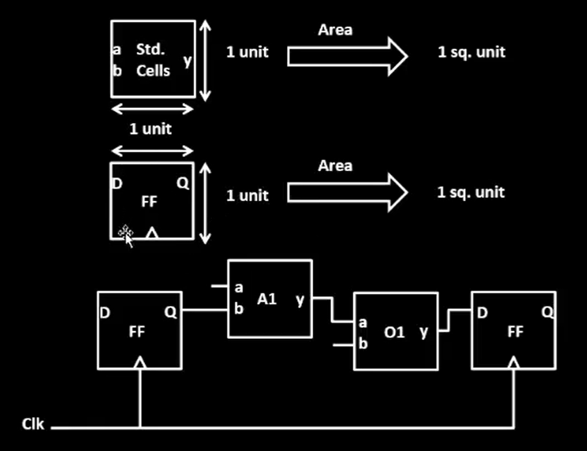

<div align="center">

# Nasscom & VSD SOC Design and Planning

</div>


> 2 Week digital VLSI SoC design and planning workshop with complete RTL2GDSII flow organised by VSD in collaboration with NASSCOM

<p align="justify"> 

# Chip Design and Validation Workflow

An overview of the **chip design and validation workflow** from initial specifications to final applications. The workflow ensures validation consistency across all stages: **O1 = O2 = O3 = O4**.  

<details><summary> 
  
#### Click to learn about the workflow stages </summary>

## **Workflow Stages**

### **O1: Specifications (C Model)**
- The design begins with defining specifications in a high-level **C model**.
- A **testbench** (in C language) is used to validate functionality early on.

---

### **O2: RTL Design (Verilog)**
- The hardware is implemented as a **soft copy** using **RTL (Verilog)**.
- Major components:
  - **Processor**
  - **Peripherals/IPs**
  - **Analog IPs**
- The design is synthesized, producing a **Gate-Level Netlist** for further validation.

---

### **O3: SoC Integration**
- Modules (processor, peripherals, macros, and analog IPs) are integrated into a **System-on-Chip (SoC)**.
- Physical design steps include:
  - **Floorplanning**
  - **Placement**
  - **Routing**
- The design undergoes:
  - **Design Rule Checks (DRC)**
  - **Layout vs. Schematic (LVS)**  
- Output: **GDSII file** for fabrication.
  
---

### **O4: Final Chip Design**
- The final chip design includes **peripherals** operating in the target frequency range.
- The **testbench** continues validating the design to ensure:
  - **O1 = O2 = O3 = O4**

---

Below are the diagrams that visually represent the chip design workflow:

### Workflow Stages (O1 to O3)
<div align="center">
  
</div>

### Final Validation and Applications (O4)
<div align="center">
  
</div>
</details>
</p>

# Section 1 - Inception of open-source EDA, OpenLANE and Sky130 PDK 

<details>
<summary> 

## Introduction to QFN-48 Package, chip, pads, core, die and Ips 
</summary>

### Overview of an Embedded Board Design
<div align="center">
  
</div>

### Inside a Package
<div align="center">
  
</div>

### Connecting the chip to the pins 
<div align="center">
  
</div>

### Chip Overview
<div align="center">
  
</div>

<br />
<p align="justify"> 
Foundry IPs are pre-designed and pre-verified blocks provided by semiconductor foundries to streamline chip design. These include critical components such as analog-to-digital converters (ADCs), digital-to-analog converters (DACs), SRAM, GPIO interfaces, and Phase-Locked Loops (PLLs).

For example, the PLL is a crucial IP block in chip design. Its primary function is to take an input clock signal (which may be of lower frequency) and generate a stable output clock signal at a higher frequency, phase-locked to the input. This is essential for processors to operate at their required high-frequency clock rates while maintaining synchronization with the input clock source.

By using foundry IPs, designers save time and effort, leveraging proven and reliable building blocks optimized for the foundry's process technology.
</p>
</details>

---

<details>
<summary> 

## Introduction to RISC-V
</summary>

### RISC-V Architecture Implementation
<div align="center">
  
</div>
<p align="justify"> 
<br />
RISC-V Architecture specifications can be implemented in the Layout using a HDL.
</p>
</details>

---

<details>
<summary> 

## From Software Applications to Hardware
</summary>

### Software Flow
<div align="center">
  
</div>
<br />
<p align="justify"> 
To run an application on hardware, several processes occur. The application enters the system software, which converts it into binary language. Key components of system software include the Operating System (OS), compiler, and assembler.  
<br />
<br />
The OS produces functions in high-level languages (e.g., C, C++, Java), which the compiler converts into hardware-specific instructions. These instructions are then processed by the assembler, which translates them into binary code (machine language). Finally, this binary code is fed to the hardware, enabling it to execute the required functions.
</p>

### Stopwatch App as an example
<div align="center">
  
</div>
<br />
<p align="justify"> 
For instance, consider a stopwatch app running on a RISC-V core. The operating system generates a small C function, which is processed by the compiler to produce RISC-V instructions. These instructions are then passed through an assembler, which converts them into binary code. This binary code is subsequently loaded onto the chip's layout for execution.
</p>

### Instruction Set Architecture (ISA)
<div align="center">
  
</div>
<br />
<p align="justify"> 
The instructions, which are part of the Instruction Set Architecture (ISA), are written in assembly language or high-level language. These are passed through an assembler (or compiler), which converts them into machine code (binary format) that the hardware can understand and execute. The RTL (Register Transfer Level) description, written in a hardware description language (e.g., Verilog or VHDL), is synthesized into a netlist (a representation of the design in terms of logic gates). This netlist is then used in the physical design process to create a layout, which represents the actual physical implementation of the circuit on silicon.
</p>

### ISA -> RTL & Synthesis -> Physical Design
<div align="center">
  
</div>
<br />
<p align="justify"> 
This course is divided into three distinct parts:
<br />

- RISC-V ISA
- RTL and synthesis of RISC-V based CPU core - picorv32
- Physical design implementation of picorv32
</p>
</details>

---

<details>
<summary> 

## Introduction to all components of open-source digital asic design
</summary>
<p align="justify"> 
For open-source ASIC design implementation, we need the following enablers available in open-source versions:
<br />

- RTL Designs
- EDA Tools
- PDK Data
</p>

<p align="justify"> 
Initially, IC design and fabrication were closely tied and limited to companies like TI and Intel. In 1979, Lynn Conway and Carver Mead introduced the idea of separating design from fabrication by developing structured methodologies based on λ-design rules, which led to the first VLSI book, *Introduction to VLSI Systems*. This approach gave rise to "fabless" companies focused on design and "pure play fabs" for fabrication.
<br /><br />
The interface between designers and fabs became a set of files called "Process Design Kits" (PDKs), which include device models, design rules, and libraries. Due to the sensitive nature of PDKs, they were previously distributed only under NDAs.
<br /><br />
However, in 2020, Google collaborated with Skywater to open-source the 130nm PDK, making it the first open-source PDK release.
</p>

<br />

<div align="center">
  
</div>

<br />

### Is Sky130nm still in use?
<div align="center">
  
</div>

<br />

<p align="justify"> 
The 130nm process accounts for 6% of the market share in pure-play IC foundry sales. It remains relevant due to its cost-effectiveness for applications that don't require the advanced performance of smaller nodes.
</p>

### Is Sky130nm fast?
<div align="center">
  
</div>

<br />

<p align="justify"> 
The 130nm process can still achieve high performance. For instance, Intel's Pentium 4 Extreme Edition ran at 3.46 GHz, and the OSU team achieved a 327 MHz clock frequency for a single-cycle RV32i CPU in post-layout simulations. A pipelined version can exceed 1 GHz. Additionally, using the Sky130 PDK, the RV32i design achieved a 398 MHz frequency with a 33.8 pJ PDP, demonstrating that 130nm can still deliver competitive speeds.
</p>

### EDA Tools
<div align="center">
  
</div>

<br />

<p align="justify"> 
ASIC design is a complex process involving numerous steps, methodologies, and EDA tools. These elements are integrated into an ASIC flow, a software that combines various tools to execute the design process.
</p>
</details>

---

<details>
<summary> 

## Simplified RTL2GDS flow
</summary>

### RTL2GDS flow
<div align="center">
  
</div>
<br />

### Chip Floor Planning
<div align="center">
  
</div>
<br />

### Macro Floor Planning
<div align="center">
  
</div>
<br />

### Power Planning
<div align="center">
  
</div>
<br />

### Placement
<div align="center">
  
</div>
<br />

<div align="center">
  
</div>
<br />

### Clock Tree Synthesis
<div align="center">
  
</div>
<br />

### Routing
<div align="center">
  
</div>
<br />

### SignOff
<div align="center">
  
</div>
<br />

</details>

---

<details>
<summary> 

## Design Synthesis - picorv32a 
</summary>
<p align="justify"> 

Aim is to run 'picorv32a' design synthesis using OpenLANE flow and generate necessary outputs and then calculate the flop ratio.

### DAY 1 LAB - To run Design Synthesis - picorv32a using OpenLANE flow

Commands to invoke the OpenLANE flow and perform synthesis

```bash
# Navigate to the OpenLANE flow directory
cd Desktop/work/tools/openlane_working_dir/openlane

# Use the alias 'docker' for the long Docker run command
# This alias simplifies invoking the OpenLANE Docker container
docker

```
```tcl
# Launch the OpenLANE flow in interactive mode
./flow.tcl -interactive

# Load the OpenLANE package for proper functionality
package require openlane 0.9

# Prepare the design environment for 'picorv32a' by creating necessary files and directories
prep -design picorv32a

# Run synthesis for the prepared design
run_synthesis

# Exit the OpenLANE flow interface
exit

# Exit the Docker container
exit

```

#### Terminal screenshots:

<div align="center">
  
</div>
<br />

<div align="center">
  
</div>
<br />

### To Calculate Flip Flop Ratio

#### Formulae:

```math
Flop\ Ratio = \frac{Number\ of\ D\ Flip\ Flops}{Total\ Number\ of\ Cells}
```
<br />

```math
Percentage\ of\ DFF's = Flop\ Ratio * 100
```
<br />

#### Terminal screenshots:

<div align="center">
  
</div>
<br />

<div align="center">
  
</div>
<br />

#### Highlighted Values for computation:

<div align="center">
  
</div>
<br />

<div align="center">
  
</div>
<br />

#### Calculation of Flop Ratio and DFF % from synthesis statistics report file:
<br />

```math
Flop\ Ratio = \frac{1613}{14876} = 0.108429
```
<br />

```math
Percentage\ of\ DFF's = 0.108429 * 100 = 10.8429\ \%
```
<br />

All picorv32a logs, reports and results can be found here:

[Section 1 Run - 02-12_18-45](https://github.com/rmahathi/nasscom-soc-design-and-planning/tree/main/02-12_18-45)

</p>
</details>
<br />

# Section 2 - Good floorplan vs bad floorplan and introduction to library cells

<details>
<summary> 

## Chip Floor Planning Considerations
</summary>

### 1. Identifying the Width of the Die and Core
<br />

<div align="center">
  
</div>
<br />

<p align="justify"> 

To determine the Utilization Factor and Aspect Ratio, the height and width of core and die areas must first be defined.

- Core is the area in a chip used for placing all the logic cells and components. It is where the logic resides in a chip.

- Die is the area encircling the core, used for placing I/O-related components.  

The height and width of the core area depend on the design's netlist. These are based on the number of components required to execute the logic. The die area's height and width depend on the core's dimensions.  

</p>

<div align="center">
  
</div>
<br />

For example, consider a netlist with two logic gates and two flip-flops, each with an area of 1 sq. unit. The total core area required is 4 sq. units.  

<div align="center">
  
</div>
<br />

Area occupied by the above netlist on a silicon wafer

<div align="center">
  
</div>
<br />

#### Utilization Factor 
Utilization Factor is the ratio of the core area occupied by the netlist to the total core area.  
For a good FloorPlan, the Utilization Factor should never be '1' to allow space for additional logic.  

```math
Utilization\ Factor = \frac{Area\ occupied\ by\ netlist}{Total\ core\ area}
```

#### Aspect Ratio 
Aspect Ratio is the ratio of the core's height to its width.  
If the Aspect Ratio is '1', the core is square. Otherwise, it is rectangular.  

```math
Aspect\ Ratio = \frac{Height\ of\ the\ core}{Width\ of\ the\ core}
```

#### Calculations
 
<div align="center">
  
</div>
<br />

```math
Utilization\ Factor = \frac{4\ sq.\ units}{4\ sq.\ units} = 1
```

```math
Aspect\ Ratio = \frac{2\ units}{2\ units} = 1\ (Square\ core)
```

### 2. Define Locations of Pre-Placed Cells

Pre-placing cells refers to reusing pre-designed blocks (e.g., memory, comparators, MUX). These blocks are called macros or IPs.  

<div align="center">
  
</div>
<br />

<div align="center">
  
</div>
<br />

<div align="center">
  
</div>
<br />

Macros should be placed close to input pins for reduced wiring length. They are placed during the Floorplan stage, with placement blockages defined to prevent standard cells from being placed nearby, and they also reduce Time-to-Market.  

### 3. Surround Pre-Placed cells with De-Coupling Capacitors
<br />

<div align="center">
  
</div>
<br />
<p align="justify"> 
Decoupling capacitors are used in SoC design near high-power-demanding blocks or macros to stabilize voltage by locally storing charge. They charge when signals switch from 0 to 1 and supply energy during peak current demands, reducing the reliance on distant power sources. The power supply wires have inherent resistance and inductance, which cause a voltage drop during current flow, leading to a slightly reduced voltage at the load (Vdd' < Vdd). This voltage drop becomes more pronounced over larger physical distances, making it difficult to maintain stable voltage levels. 
</p>
<div align="center">
  
</div>
<br />

If the drop pushes the voltage below the noise margin, the circuit may enter an undefined state, resulting in failures or incorrect outputs. 

<div align="center">
  
</div>
<br />

Decoupling capacitors mitigate this by supplying the required energy locally during switching, ensuring stable operation and preventing voltage drops from falling below safe levels.

<div align="center">
  
</div>
<br />

### 4. Power Planning 

In power planning for SoC design, consider a macro where a 16-bit orange bus carries a 0-to-1 signal. Being far from the power source introduces voltage drops due to resistance and inductance in the supply wires.


<div align="center">
  
</div>
<br />

To handle signal transitions, drivers (e.g., inverters) are employed. An inverter converts the input signal to its complement (0 to 1 or 1 to 0), driving the next stage effectively.

<div align="center">
  
</div>
<br />

<p align="justify"> 

1-to-0 Transition - Ground Bounce:

In a 1-to-0 transition, the previously charged nodes discharge rapidly to ground. If all 16 bits discharge at once, the ground potential may fluctuate, causing a phenomenon called ground bounce. This occurs due to inductance in the ground path, leading to temporary voltage spikes. If the ground bounce crosses the noise margin, it can cause unpredictable behavior, further increasing the risk of errors in circuit operation.

</p>

<div align="center">
  
</div>
<br />

0-to-1 Transition - Voltage Drop:

<p align="justify"> 

When a 0-to-1 transition occurs, the driver charges the load capacitance of the connected circuit. This charging demands significant current, especially for all 16 bits transitioning simultaneously. A voltage drop across the supply wires may occur due to the high current demand, reducing Vdd' and risking a voltage level near or below the noise margin. If the voltage drops significantly, the circuit can enter an undefined state, leading to unreliable outputs.

</p>

<div align="center">
  
</div>
<br />

<p align="justify"> 

Simultaneous Switching Problem:

When multiple signals (0-to-1 or 1-to-0) switch at the same time, the cumulative current demand rises sharply. For a 0-to-1 transition, the power supply must provide a surge of current to charge the capacitors, while for a 1-to-0 transition, a large discharge current flows to ground. Both cases can result in severe voltage drops or ground bounce due to the limitations of a single-point power supply.

</p>

<div align="center">
  
</div>
<br />

<p align="justify"> 

Solution: Power Mesh
The solution is to replace the single-point power supply with a power mesh. A power mesh distributes Vdd and ground throughout the chip using a network of interconnected wires, reducing the resistance and inductance between the source and various blocks. By bringing power closer to the loads and reducing the effective distance, the voltage drop and ground bounce are minimized. The power mesh ensures that all parts of the circuit can access stable supply and ground levels, even during peak current demands, maintaining signal integrity and preventing undefined states.

</p>

<div align="center">
  
</div>
<br />

### 5. Pin Placement 

Pin placement impacts wire length and connectivity. Pins must be placed to minimize wire length.  
For example, an input pin driving two blocks should be near them.  

<div align="center">
  
</div>
<br />

<p align="justify"> 

In effective pin placement:  
1. Pin order is based on connectivity, not sequence.  
2. Clock pins are larger due to their importance and susceptibility to delays. Voltage drops in the clock signal leads to failure of the chip, which is why we use higher metal layers for routing the clock in the design.

</p>

<div align="center">
  
</div>
<br />

### 6. Logical Cell Placement Blockage

Placement blockages outside the core and inside the die prevents automated placement and routing tool from placing any other cells into the the pin-dedicated area.

<div align="center">
  
</div>
<br />

</details>

### DAY 2 LAB - To run Design Floorplan - picorv32a using OpenLANE flow

<p align="justify"> 

Before initiating the floorplan stage, designers must verify and adjust crucial switches that control the floorplan's characteristics. These configuration parameters, including utilization factor and aspect ratio, must align with the project's specific requirements to ensure optimal floorplan execution. A proper review of these switches helps prevent potential issues and ensures the floorplan process proceeds as intended.

</p>
